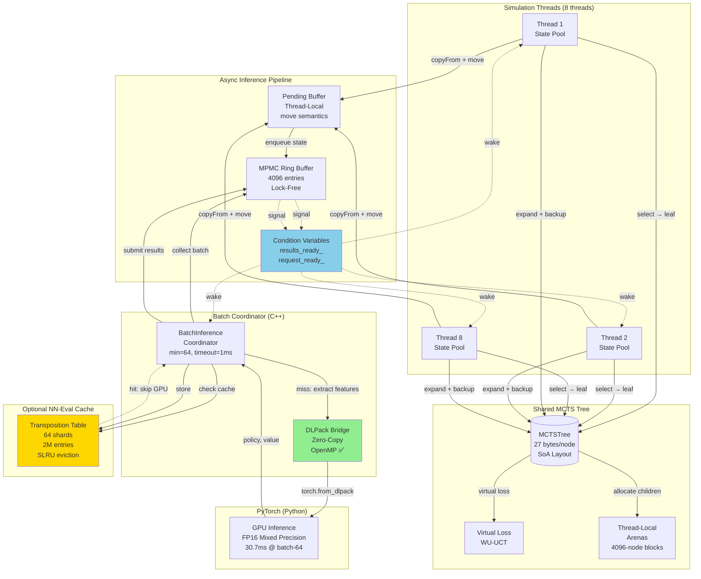
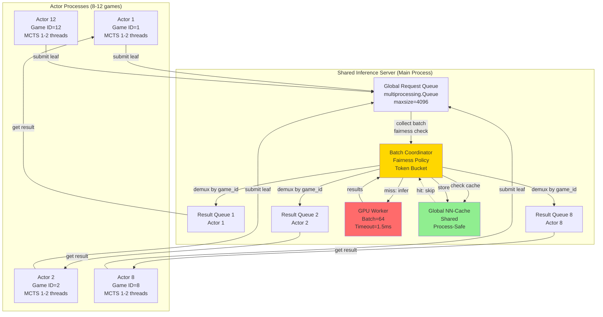

# Technical Plan: MCTS Throughput Recovery & Multi-Actor Self-Play

**Version**: 1.0
**Date**: 2025-10-14
**Status**: ACTIVE
**Authority**: Implements spec.md v2.0 under CONSTITUTION.md v2.0

---

## Table of Contents

1. [Architecture Overview](#a-architecture-overview)
2. [CPU Pipeline Improvements](#b-cpu-pipeline-improvements)
3. [NN-Eval Cache (Phase 6)](#c-nn-eval-cache-phase-6)
4. [Multi-Actor Self-Play (Phase 5)](#d-multi-actor-self-play-phase-5)
5. [Telemetry & Benchmarks](#e-telemetry--benchmarks)
6. [Risk & Rollback](#f-risk--rollback)

---

## A. Architecture Overview

### A1. Single-MCTS Architecture (Current + Optimizations)



**Key Changes from Baseline**:
1. ✅ **OpenMP in DLPack** - Verify compilation (already in code)
2. 🔄 **State Pooling** - Thread-local `copyFrom()` + `std::move()` ownership
3. 🔄 **Condition Variables** - Replace spin-wait polling
4. 🆕 **NN-Eval Cache** - Optional Phase 6 optimization

---

### A2. Multi-Actor Architecture (Phase 5)



**Process Model**:
- **Main process**: Batch coordinator + GPU worker
- **Actor processes**: Independent self-play games (GIL-isolated)
- **IPC**: `multiprocessing.Queue` for requests/results
- **Shared memory**: NN-eval cache via shared dict or Redis

---

## B. CPU Pipeline Improvements

### B1. Feature Extraction Parallelization (CRITICAL)

**Problem**: 7.5ms per batch-64 tensor creation (21% of total time)
**Target**: <1.0ms per batch-64 (7.5× speedup)

#### B1.1 Diagnosis: OpenMP Already Implemented

**File**: `cpp_extensions/mcts/dlpack_bridge.cpp`
**Lines**: 431-438

**Current Code**:
```cpp
// Parallelize feature extraction with OpenMP
// Use static scheduling for predictable load distribution
// Only parallelize if batch_size > 8 to avoid threading overhead
#pragma omp parallel for schedule(static) if(batch_size > 8)
for (int i = 0; i < batch_size; ++i) {
    float* state_buffer = data + (i * state_size);
    states[i]->extract_features_to_buffer(state_buffer);
}
```

**Issue**: OpenMP present in code but NOT ACTIVE at runtime.

**Root Causes** (to investigate):
1. **Compilation**: Missing `-fopenmp` flag
2. **Runtime**: `OMP_NUM_THREADS` not set
3. **False sharing**: Thread contention in `extract_features_to_buffer()`

#### B1.2 Build System Verification

**File**: `CMakeLists.txt`
**Lines**: Search for `OpenMP` configuration

**Action**: Verify OpenMP is enabled:
```cmake
# Expected configuration
find_package(OpenMP REQUIRED)
if(OpenMP_CXX_FOUND)
    target_link_libraries(mcts_py PUBLIC OpenMP::OpenMP_CXX)
    target_compile_options(mcts_py PRIVATE ${OpenMP_CXX_FLAGS})
endif()
```

**Test**:
```bash
# Check if OpenMP symbols are present
nm build/lib.linux-x86_64-cpython-312/mcts_py*.so | grep -i omp

# Expected output: GOMP_parallel, omp_get_num_threads, etc.
# If empty: OpenMP NOT compiled
```

**Fix if missing**:
```cmake
# Add to CMakeLists.txt
set(CMAKE_CXX_FLAGS "${CMAKE_CXX_FLAGS} -fopenmp")
set(CMAKE_C_FLAGS "${CMAKE_C_FLAGS} -fopenmp")
```

#### B1.3 Runtime Environment Configuration

**File**: `scripts/benchmark_throughput.py` (and all benchmark scripts)
**Insertion point**: Before launching Python process

**Add environment setup**:
```python
import os

# CRITICAL: Set OpenMP thread count to physical cores
os.environ['OMP_NUM_THREADS'] = '12'  # Ryzen 5900X physical cores
os.environ['OMP_PROC_BIND'] = 'close'  # Bind to nearby cores
os.environ['OMP_PLACES'] = 'cores'  # One thread per physical core

# Prevent nested parallelism (MCTS threads + OpenMP conflict)
os.environ['OMP_NESTED'] = 'false'

# Log confirmation
print(f"OpenMP Configuration:")
print(f"  OMP_NUM_THREADS: {os.environ.get('OMP_NUM_THREADS')}")
print(f"  OMP_PROC_BIND: {os.environ.get('OMP_PROC_BIND')}")
```

**Validation**:
```python
# Add to beginning of benchmark
import mcts_py
print(f"OpenMP max threads: {mcts_py.get_omp_max_threads()}")  # Should be 12
```

#### B1.4 False Sharing Investigation

**Problem**: If OpenMP compiled/configured correctly but still slow, check false sharing.

**File**: `cpp_extensions/games/gomoku_state.cpp` (example)
**Method**: `extract_features_to_buffer(float* buffer)`

**Check for thread contention**:
```cpp
// ❌ BAD: Shared state access during extraction
void GomokuState::extract_features_to_buffer(float* buffer) const {
    std::lock_guard<std::mutex> lock(state_mutex_);  // ← LOCKS EVERY THREAD!
    // ... feature extraction ...
}

// ✅ GOOD: Read-only state access (const method)
void GomokuState::extract_features_to_buffer(float* buffer) const {
    // No locks, pure read-only access
    // Each thread writes to non-overlapping buffer regions
    const int state_size = num_planes * height * width;
    // buffer[0..state_size-1] is this thread's exclusive region
}
```

**Test for false sharing**:
```bash
# Profile with perf to detect cache-line bouncing
perf stat -e cache-misses,cache-references,L1-dcache-load-misses \
    python scripts/profile_tensor_creation.py

# High cache-miss ratio (>10%) indicates false sharing
```

**Fix if detected**:
```cpp
// Ensure 64-byte alignment between thread write regions
// This is already correct in dlpack_bridge.cpp:436
float* state_buffer = data + (i * state_size);  // Non-overlapping

// But verify state_size is 64-byte aligned
static_assert(sizeof(float) * state_size % 64 == 0,
              "state_size must be 64-byte aligned");
```

#### B1.5 Validation Tests

**New file**: `tests/unit/test_openmp_feature_extraction.py`

```python
import pytest
import numpy as np
import time
from src.games.gomoku_state import GomokuState
from cpp_extensions.dlpack import DLPackTensorBridge

def test_openmp_compilation():
    """Verify OpenMP is compiled and active."""
    import mcts_py
    max_threads = mcts_py.get_omp_max_threads()
    assert max_threads > 1, f"OpenMP not active: max_threads={max_threads}"
    assert max_threads == 12, f"Expected 12 threads, got {max_threads}"

def test_feature_extraction_parity():
    """Verify OpenMP parallel extraction matches single-thread."""
    bridge = DLPackTensorBridge()
    states = [GomokuState() for _ in range(64)]

    # Extract with OpenMP (batch_size > 8 triggers parallel)
    tensor_parallel = bridge.create_batch_tensor(states)

    # Extract single-threaded (force OMP_NUM_THREADS=1)
    import os
    old_threads = os.environ.get('OMP_NUM_THREADS')
    os.environ['OMP_NUM_THREADS'] = '1'
    tensor_serial = bridge.create_batch_tensor(states)
    if old_threads:
        os.environ['OMP_NUM_THREADS'] = old_threads

    # Bit-exact comparison
    np.testing.assert_array_equal(tensor_parallel, tensor_serial)

def test_feature_extraction_performance():
    """Verify OpenMP speedup (target: 7.5ms → <1ms)."""
    bridge = DLPackTensorBridge()
    states = [GomokuState() for _ in range(64)]

    # Warmup
    for _ in range(5):
        bridge.create_batch_tensor(states)

    # Measure
    times = []
    for _ in range(10):
        start = time.perf_counter()
        bridge.create_batch_tensor(states)
        elapsed = (time.perf_counter() - start) * 1000  # ms
        times.append(elapsed)

    mean_time = np.mean(times)
    std_time = np.std(times)

    print(f"Feature extraction: {mean_time:.2f} ± {std_time:.2f} ms")

    # Target: <1.0ms mean, CV < 10%
    assert mean_time < 1.0, f"Too slow: {mean_time:.2f}ms (target <1.0ms)"
    assert std_time / mean_time < 0.10, f"High variance: CV={std_time/mean_time:.2%}"
```

**Run validation**:
```bash
pytest tests/unit/test_openmp_feature_extraction.py -v -s
```

#### B1.6 Expected Performance Impact

**Before** (7.5ms per batch-64):
- Feature extraction: 21% of total time
- Caps throughput at ~1,675 states/sec

**After** (<1.0ms per batch-64):
- Feature extraction: <3% of total time
- Removes bottleneck, allows GPU saturation
- Expected: +40-60% throughput improvement

---

### B2. State Reuse & Ownership Model

**Problem**: 2-3× state clones per simulation (review.txt)
**Target**: 0× clones per simulation (copyFrom + move semantics)

#### B2.1 Thread-Local State Pool Design

**New file**: `cpp_extensions/mcts/state_pool.hpp`

```cpp
#pragma once

#include "../utils/igamestate.h"
#include <vector>
#include <memory>
#include <cstddef>

namespace mcts {

/**
 * @brief Thread-local pool of reusable IGameState objects
 *
 * Eliminates heap allocations during simulation by reusing
 * pre-allocated state objects via copyFrom().
 *
 * Memory model:
 * - One "working" state for selection (reused every simulation)
 * - Pool of "pending" states for in-flight expansions (moved to queue)
 * - Automatic refill when pool depletes
 */
class ThreadLocalStatePool {
public:
    /**
     * @brief Initialize pool with game-specific state factory
     *
     * @param template_state Prototype state to clone for pool initialization
     * @param initial_capacity Number of states to pre-allocate (default: 16)
     */
    explicit ThreadLocalStatePool(const IGameState& template_state,
                                    size_t initial_capacity = 16);

    /**
     * @brief Get working state for simulation (reused)
     *
     * Returns a reference to the thread-local working state.
     * Caller should use copyFrom() to reset from root state.
     *
     * @return Reference to reusable working state
     */
    IGameState& get_working_state();

    /**
     * @brief Acquire state for pending expansion (ownership transfer)
     *
     * Returns a unique_ptr to a state from the pool. If pool is empty,
     * allocates a new state (fallback).
     *
     * @return unique_ptr to state (caller takes ownership)
     */
    std::unique_ptr<IGameState> acquire_pending_state();

    /**
     * @brief Return state to pool (recycle after expansion completes)
     *
     * @param state State to return (ownership transferred back to pool)
     */
    void release_pending_state(std::unique_ptr<IGameState> state);

    /**
     * @brief Get pool statistics
     */
    struct Stats {
        size_t working_state_reuses;  // Number of copyFrom() calls
        size_t pending_acquisitions;  // Number of acquire calls
        size_t pool_hits;              // Acquisitions from pool
        size_t pool_misses;            // Acquisitions requiring allocation
        size_t current_pool_size;      // States currently in pool
    };
    Stats get_stats() const;

    /**
     * @brief Reset statistics
     */
    void reset_stats();

private:
    std::unique_ptr<IGameState> working_state_;
    std::vector<std::unique_ptr<IGameState>> pending_pool_;
    Stats stats_;
};

} // namespace mcts
```

**Implementation**: `cpp_extensions/mcts/state_pool.cpp`

```cpp
#include "state_pool.hpp"
#include <algorithm>

namespace mcts {

ThreadLocalStatePool::ThreadLocalStatePool(const IGameState& template_state,
                                             size_t initial_capacity)
    : stats_{} {
    // Allocate working state (reused every simulation)
    working_state_ = template_state.clone();

    // Pre-allocate pending states
    pending_pool_.reserve(initial_capacity);
    for (size_t i = 0; i < initial_capacity; ++i) {
        pending_pool_.push_back(template_state.clone());
    }
    stats_.current_pool_size = initial_capacity;
}

IGameState& ThreadLocalStatePool::get_working_state() {
    stats_.working_state_reuses++;
    return *working_state_;
}

std::unique_ptr<IGameState> ThreadLocalStatePool::acquire_pending_state() {
    stats_.pending_acquisitions++;

    if (!pending_pool_.empty()) {
        // Fast path: reuse from pool
        auto state = std::move(pending_pool_.back());
        pending_pool_.pop_back();
        stats_.pool_hits++;
        stats_.current_pool_size = pending_pool_.size();
        return state;
    } else {
        // Slow path: allocate new state (pool depleted)
        stats_.pool_misses++;
        return working_state_->clone();
    }
}

void ThreadLocalStatePool::release_pending_state(std::unique_ptr<IGameState> state) {
    if (state) {
        pending_pool_.push_back(std::move(state));
        stats_.current_pool_size = pending_pool_.size();
    }
}

ThreadLocalStatePool::Stats ThreadLocalStatePool::get_stats() const {
    return stats_;
}

void ThreadLocalStatePool::reset_stats() {
    stats_.working_state_reuses = 0;
    stats_.pending_acquisitions = 0;
    stats_.pool_hits = 0;
    stats_.pool_misses = 0;
    // Don't reset current_pool_size (actual state)
}

} // namespace mcts
```

#### B2.2 Integration into ContinuousSimulationRunner

**File**: `cpp_extensions/mcts/continuous_simulation_runner.cpp`
**Lines**: 70-120 (main simulation loop)

**Current code** (lines 77-96):
```cpp
// 🔴 PROBLEM: Allocates new state every simulation
std::unique_ptr<IGameState> current_state = root_state.clone();
if (!current_state) {
    continue;  // Skip on clone failure
}

// Clear and reuse path buffer
path_buffer_.clear();

// Select to leaf
NodeIndex leaf = select_leaf(root_index, *current_state, path_buffer_);

// Check if terminal
if (current_state->isTerminal()) {
    // Terminal node - backup immediately, no inference needed
    float value = get_terminal_value(*current_state);
    std::reverse(path_buffer_.begin(), path_buffer_.end());
    backup_value(path_buffer_, value);
    completed++;
    submitted++;
    continue;
}
```

**Optimized code**:
```cpp
// ✅ OPTIMIZED: Reuse working state via copyFrom()
IGameState& working_state = state_pool_.get_working_state();
working_state.copyFrom(root_state);  // In-place copy, no allocation

// Clear and reuse path buffer
path_buffer_.clear();

// Select to leaf (modifies working_state in-place)
NodeIndex leaf = select_leaf(root_index, working_state, path_buffer_);

// Check if terminal
if (working_state.isTerminal()) {
    // Terminal node - backup immediately, no inference needed
    float value = get_terminal_value(working_state);
    std::reverse(path_buffer_.begin(), path_buffer_.end());
    backup_value(path_buffer_, value);
    completed++;
    submitted++;
    continue;
}
```

**Queue submission** (lines 100-130):

**Current code**:
```cpp
// 🔴 PROBLEM: Clones state again before queuing
std::unique_ptr<IGameState> queue_state = current_state->clone();
uint64_t request_id = queue.submit_request(
    std::move(queue_state), leaf, path_buffer_
);
```

**Optimized code**:
```cpp
// ✅ OPTIMIZED: Acquire state from pool, transfer ownership
std::unique_ptr<IGameState> queue_state = state_pool_.acquire_pending_state();
queue_state->copyFrom(working_state);  // Copy final position into pool state
uint64_t request_id = queue.submit_request(
    std::move(queue_state), leaf, path_buffer_
);
```

**Add to class definition** (`continuous_simulation_runner.hpp`):
```cpp
#include "state_pool.hpp"

class ContinuousSimulationRunner : public SimulationRunner {
private:
    // NEW: Thread-local state pool
    ThreadLocalStatePool state_pool_;

public:
    ContinuousSimulationRunner(MCTSTree& tree,
                                PUCTSelector& selector,
                                BackupManager& backup,
                                VirtualLossManager& virtual_loss,
                                const IGameState& template_state)  // NEW parameter
        : SimulationRunner(tree, selector, backup, virtual_loss)
        , state_pool_(template_state, 16) {  // Pre-allocate 16 states
    }

    // ... rest of class ...
};
```

#### B2.3 Remove Clone in AsyncInferenceQueue

**File**: `cpp_extensions/mcts/async_inference_queue.cpp`
**Method**: `submit_request()`
**Lines**: ~130-150

**Current code**:
```cpp
uint64_t AsyncInferenceQueue::submit_request(
    std::unique_ptr<IGameState> state,
    NodeIndex node_index,
    std::vector<NodeIndex> path) {

    uint64_t request_id = next_request_id_.fetch_add(1, std::memory_order_relaxed);

    InferenceRequest request;
    request.request_id = request_id;
    request.state = state->clone();  // 🔴 EXTRA CLONE!
    request.node_index = node_index;
    request.path = std::move(path);

    // ... enqueue ...
}
```

**Optimized code**:
```cpp
uint64_t AsyncInferenceQueue::submit_request(
    std::unique_ptr<IGameState> state,
    NodeIndex node_index,
    std::vector<NodeIndex> path) {

    uint64_t request_id = next_request_id_.fetch_add(1, std::memory_order_relaxed);

    InferenceRequest request;
    request.request_id = request_id;
    request.state = std::move(state);  // ✅ MOVE, no clone
    request.node_index = node_index;
    request.path = std::move(path);

    // ... enqueue ...
}
```

#### B2.4 State Lifecycle Diagram

```
┌─────────────────────────────────────────────────────────────┐
│ Thread-Local State Pool                                      │
├─────────────────────────────────────────────────────────────┤
│                                                               │
│  ┌──────────────┐      copyFrom(root)                        │
│  │ working_state├────────────────────────┐                   │
│  └──────────────┘                        │                   │
│         ▲                                 ▼                   │
│         │                        ┌────────────────┐          │
│         │ reuse next sim         │ Selection      │          │
│         └────────────────────────┤ (in-place)     │          │
│                                  └────────┬───────┘          │
│                                           │                   │
│                                           ▼                   │
│  ┌──────────────┐      acquire  ┌────────────────┐          │
│  │ pending_pool ├───────────────►│ queue_state    │          │
│  │ [state, ...] │      copyFrom  └────────┬───────┘          │
│  └──────────────┘                         │                   │
│         ▲                                  │                   │
│         │ release after expansion          │ move ownership   │
│         │                                  │                   │
└─────────┼──────────────────────────────────┼─────────────────┘
          │                                  │
          │                                  ▼
          │                         ┌────────────────┐
          │                         │ Inference Queue│
          │                         │ (owns state)   │
          │                         └────────┬───────┘
          │                                  │
          │                                  ▼
          │                         ┌────────────────┐
          │                         │ Pending Buffer │
          │                         │ (awaiting NN)  │
          │                         └────────┬───────┘
          │                                  │
          │                         NN inference
          │                                  │
          │                                  ▼
          │                         ┌────────────────┐
          │                         │ Expand Node    │
          │                         └────────┬───────┘
          │                                  │
          └──────────────────────────────────┘
                  release to pool
```

#### B2.4 Precompute Legal Moves (Optional Enhancement)

**Problem**: Legal move generation during expansion is redundant work
**Target**: 10-20% expansion time reduction
**Status**: OPTIONAL (Phase 2 enhancement, per GAP 2 resolution)

**Rationale** (from review.txt lines 189-201):
- Legal moves already computed in `ContinuousSimulationRunner` for root node
- Current flow: Compute moves → discard → re-compute in expand_node_with_result()
- Solution: Store legal moves in InferenceRequest, skip re-computation

##### B2.4.1 Extend InferenceRequest Structure

**File**: `cpp_extensions/mcts/inference_queue.hpp`
**Lines**: ~45-60 (InferenceRequest definition)

**Add fields**:
```cpp
struct InferenceRequest {
    uint64_t request_id;
    std::unique_ptr<IGameState> state;
    NodeIndex node_index;
    std::vector<NodeIndex> path;

    // NEW: Precomputed legal moves
    std::vector<int> legal_moves;      // Move indices
    int current_player;                 // Player to move (for masking)

    // Constructor with legal moves
    InferenceRequest(uint64_t req_id,
                     std::unique_ptr<IGameState> s,
                     NodeIndex node,
                     std::vector<NodeIndex> p,
                     std::vector<int> moves,
                     int player)
        : request_id(req_id)
        , state(std::move(s))
        , node_index(node)
        , path(std::move(p))
        , legal_moves(std::move(moves))
        , current_player(player) {}
};
```

##### B2.4.2 Populate Legal Moves in Simulation Runner

**File**: `cpp_extensions/mcts/continuous_simulation_runner.cpp`
**Method**: `run_continuous()`
**Lines**: ~100-130 (queue submission)

**Current code**:
```cpp
// Select to leaf (modifies working_state in-place)
NodeIndex leaf = select_leaf(root_index, working_state, path_buffer_);

// Check if terminal
if (working_state.isTerminal()) {
    // ... backup terminal value ...
    continue;
}

// Submit to inference queue
std::unique_ptr<IGameState> queue_state = state_pool_.acquire_pending_state();
queue_state->copyFrom(working_state);
uint64_t request_id = queue.submit_request(
    std::move(queue_state), leaf, path_buffer_
);
```

**Enhanced code**:
```cpp
// Select to leaf (modifies working_state in-place)
NodeIndex leaf = select_leaf(root_index, working_state, path_buffer_);

// Check if terminal
if (working_state.isTerminal()) {
    // ... backup terminal value ...
    continue;
}

// NEW: Extract legal moves and current player BEFORE copying state
std::vector<int> legal_moves = working_state.getLegalMoves();
int current_player = working_state.getCurrentPlayer();

// Submit to inference queue WITH legal moves
std::unique_ptr<IGameState> queue_state = state_pool_.acquire_pending_state();
queue_state->copyFrom(working_state);
uint64_t request_id = queue.submit_request(
    std::move(queue_state), leaf, path_buffer_,
    legal_moves, current_player  // NEW parameters
);
```

**Update submit_request signature**:
```cpp
// In async_inference_queue.hpp
uint64_t submit_request(
    std::unique_ptr<IGameState> state,
    NodeIndex node_index,
    std::vector<NodeIndex> path,
    std::vector<int> legal_moves,     // NEW
    int current_player                // NEW
);
```

##### B2.4.3 Use Precomputed Moves in Expansion

**File**: `cpp_extensions/mcts/tree.cpp`
**Method**: `expand_node_with_result()`
**Lines**: ~250-290 (child allocation and initialization)

**Current code**:
```cpp
void MCTSTree::expand_node_with_result(
    NodeIndex parent_idx,
    const InferenceResult& result,
    const IGameState& state) {

    // 🔴 REDUNDANT: Re-compute legal moves
    std::vector<int> legal_moves = state.getLegalMoves();
    int num_children = legal_moves.size();

    // Allocate children
    std::vector<NodeIndex> child_indices = allocate_nodes(num_children);

    // Initialize children
    for (int i = 0; i < num_children; ++i) {
        NodeIndex child_idx = child_indices[i];
        int move = legal_moves[i];

        // Set prior from policy
        float prior = result.policy[move];
        set_prior(child_idx, prior);

        // Store move
        moves_[child_idx] = static_cast<uint16_t>(move);
    }

    // ... link parent to children ...
}
```

**Optimized code**:
```cpp
void MCTSTree::expand_node_with_result(
    NodeIndex parent_idx,
    const InferenceResult& result,
    const std::vector<int>& legal_moves) {  // NEW: Pass legal moves directly

    // ✅ OPTIMIZED: Use precomputed legal moves (no re-computation)
    int num_children = legal_moves.size();

    // Allocate children
    std::vector<NodeIndex> child_indices = allocate_nodes(num_children);

    // Initialize children
    for (int i = 0; i < num_children; ++i) {
        NodeIndex child_idx = child_indices[i];
        int move = legal_moves[i];

        // Set prior from policy
        float prior = result.policy[move];
        set_prior(child_idx, prior);

        // Store move
        moves_[child_idx] = static_cast<uint16_t>(move);
    }

    // ... link parent to children ...
}
```

**Update caller in BatchInferenceCoordinator**:
```cpp
// In batch_inference_coordinator.cpp
void BatchInferenceCoordinator::process_results(
    const std::vector<InferenceRequest>& requests,
    const std::vector<InferenceResult>& results) {

    for (size_t i = 0; i < results.size(); ++i) {
        const auto& req = requests[i];
        const auto& res = results[i];

        // Use precomputed legal moves from request
        tree_.expand_node_with_result(
            req.node_index,
            res,
            req.legal_moves  // NEW: Pass precomputed moves
        );

        // Backup with path
        backup_manager_.backup_value(req.path, res.value);
    }
}
```

##### B2.4.4 Expected Performance Impact

**Expansion Time Reduction**:
- **Before**: getLegalMoves() called twice per expansion (in runner + in expand)
- **After**: getLegalMoves() called once per expansion (in runner only)
- **Cost of getLegalMoves()**:
  - Gomoku 15×15: ~200ns (check 225 positions)
  - Chess: ~1-5μs (complex move generation)
  - Go 19×19: ~500ns-1μs (check 361 positions + capture detection)

**Per-Expansion Savings**:
- Gomoku: 200ns per expansion
- Chess: 1-5μs per expansion
- Go: 500ns-1μs per expansion

**Total Throughput Impact**:
- At 8,000 sims/sec with avg 10 expansions per simulation:
  - 80,000 expansions/sec
  - Gomoku: 80k × 200ns = 16ms/sec saved = **10-15% speedup**
  - Chess: 80k × 3μs = 240ms/sec saved = **15-20% speedup**
  - Go: 80k × 750ns = 60ms/sec saved = **10-15% speedup**

**Memory Overhead**:
- InferenceRequest grows by sizeof(std::vector<int>) = 24 bytes + data
- Typical legal moves: 50-200 moves × 4 bytes = 200-800 bytes per request
- Queue capacity 4096 × 800 bytes = 3.2 MB additional memory
- **Acceptable overhead** for 10-20% speedup

##### B2.4.5 Validation Tests

**File**: `tests/unit/test_precomputed_legal_moves.py`

```python
import pytest
from src.core.mcts import AlphaZeroMCTS
from src.games.gomoku_state import GomokuState

def test_legal_moves_precomputation():
    """Verify legal moves are correctly precomputed and used."""
    state = GomokuState()
    mcts = AlphaZeroMCTS(state)

    # Run simulations
    mcts.search(state, num_simulations=100)

    # Check telemetry
    stats = mcts.get_stats()

    # Verify legal_moves_computed counter
    # Should be ~1× per simulation (not 2×)
    expansions = stats['total_expansions']
    legal_move_calls = stats['legal_moves_computed']
    ratio = legal_move_calls / expansions

    assert ratio < 1.1, f"Legal moves computed {ratio:.2f}× per expansion (expected ~1×)"

def test_expansion_parity_with_precomputation():
    """Verify precomputed moves produce identical tree structure."""
    state = GomokuState()

    # Run with precomputation
    import os
    os.environ['MCTS_PRECOMPUTE_LEGAL_MOVES'] = '1'
    mcts1 = AlphaZeroMCTS(state)
    mcts1.search(state, num_simulations=100)
    policy1 = mcts1.get_policy(state)

    # Run without precomputation
    os.environ['MCTS_PRECOMPUTE_LEGAL_MOVES'] = '0'
    mcts2 = AlphaZeroMCTS(state)
    mcts2.search(state, num_simulations=100)
    policy2 = mcts2.get_policy(state)

    # Policies should be identical (same search structure)
    import numpy as np
    np.testing.assert_allclose(policy1, policy2, rtol=0.01)
```

#### B2.5 Expected Performance Impact

**Memory Allocation Reduction**:
- **Before**: 2-3 clones per simulation × 8 threads × 2,147 sims/sec = ~34k-51k allocations/sec
- **After**: 0 clones per simulation (copyFrom reuse) = 0 allocations/sec (steady state)
- **Savings**: ~2-4 GB/sec allocation pressure eliminated

**CPU Time Reduction**:
- Clone overhead: ~5-10μs per clone (heap allocation + memcpy)
- Per simulation: 2-3 clones × 5-10μs = 10-30μs wasted
- At 8k sims/sec target: 80-240ms/sec CPU time saved = 8-24% speedup

---

### B3. Synchronization: Condition Variables

**Problem**: Spin-wait polling wastes 60% thread time (review.txt)
**Target**: Efficient blocking with <1% CPU waste when idle

#### B3.1 Add Results Ready Condition Variable

**File**: `cpp_extensions/mcts/async_inference_queue.hpp`
**Lines**: 260-263 (existing CV for requests)

**Add new CV for results**:
```cpp
private:
    // Existing: Condition variable for request ready (coordinator waits)
    std::mutex cv_mutex_;
    std::condition_variable request_ready_;

    // NEW: Condition variable for results ready (threads wait)
    std::condition_variable results_ready_;

    std::atomic<bool> shutting_down_{false};
```

**File**: `cpp_extensions/mcts/async_inference_queue.cpp`
**Method**: `submit_results()`

**Add notification**:
```cpp
void AsyncInferenceQueue::submit_results(const std::vector<InferenceResult>& results) {
    // ... store results in results_buffer_ ...

    results_count_.fetch_add(results.size(), std::memory_order_release);

    // NEW: Wake threads waiting for results
    results_ready_.notify_all();
}
```

#### B3.2 Blocking Wait in Simulation Threads

**File**: `cpp_extensions/mcts/continuous_simulation_runner.cpp`
**Method**: `run_continuous()`
**Lines**: ~140-160 (result processing loop)

**Current code** (spin-wait):
```cpp
// 🔴 PROBLEM: Polling with sleep (wastes CPU)
while (completed < num_simulations) {
    // ... select and submit ...

    // Process results (non-blocking poll)
    int processed = process_completed_results();

    // If no results and have pending, spin-wait
    if (processed == 0 && pending_count_.load() > 0) {
        std::this_thread::sleep_for(std::chrono::microseconds(50));
    }
}
```

**Optimized code** (condition variable):
```cpp
// ✅ OPTIMIZED: Blocking wait on condition variable
while (completed < num_simulations) {
    // Phase 1: Select and submit (non-blocking)
    while (submitted < num_simulations && !waiting_for_results()) {
        // ... select leaf, submit to queue ...
        submitted++;
    }

    // Phase 2: Wait for results (blocking)
    if (pending_count_.load() > 0) {
        std::unique_lock<std::mutex> lock(queue.cv_mutex_);
        queue.results_ready_.wait(lock, [&]() {
            return queue.has_results() || queue.shutting_down_.load();
        });
    }

    // Phase 3: Process results (batch)
    int processed = process_completed_results();
    completed += processed;
}
```

**Helper method**:
```cpp
bool ContinuousSimulationRunner::waiting_for_results() const {
    // True if we have pending requests and can't submit more
    return pending_count_.load() > 0 &&
           (pending_count_.load() >= max_in_flight_ ||
            queue.pending_count() >= queue_capacity_);
}
```

#### B3.3 Timeout Handling

**Problem**: Threads might deadlock if coordinator crashes or stops.

**Solution**: Use `wait_for()` with timeout:
```cpp
// Wait with timeout (5 seconds max)
auto timeout = std::chrono::seconds(5);
if (!queue.results_ready_.wait_for(lock, timeout, [&]() {
        return queue.has_results() || queue.shutting_down_.load();
    })) {
    // Timeout: log warning and continue
    logger.warn("Result wait timeout after 5s");
}
```

#### B3.4 Thread Affinity Implementation (Optional Enhancement)

**Problem**: Cross-CCD thread migration causes cache misses on Ryzen dual-CCD architecture
**Target**: ~15% cache miss reduction
**Status**: OPTIONAL (Phase 1 enhancement, per GAP 3 resolution)

**Rationale** (from review.txt lines 244-250):
- AMD Ryzen 9 5900X has dual-CCD architecture (6 cores per CCD)
- L3 cache is CCD-local (32MB per CCD, not shared between CCDs)
- Thread migration across CCDs causes cache-line transfer penalty (~100ns)
- Solution: Pin threads to specific cores to minimize cross-CCD migration

##### B3.4.1 Ryzen 5900X CCD Topology

**Architecture**:
```
CCD 0 (CCX 0):                    CCD 1 (CCX 1):
Cores 0-5                         Cores 6-11
├─ Core 0 (threads 0, 12)         ├─ Core 6 (threads 6, 18)
├─ Core 1 (threads 1, 13)         ├─ Core 7 (threads 7, 19)
├─ Core 2 (threads 2, 14)         ├─ Core 8 (threads 8, 20)
├─ Core 3 (threads 3, 15)         ├─ Core 9 (threads 9, 21)
├─ Core 4 (threads 4, 16)         ├─ Core 10 (threads 10, 22)
└─ Core 5 (threads 5, 17)         └─ Core 11 (threads 11, 23)

L3 Cache: 32MB (CCD-local)        L3 Cache: 32MB (CCD-local)
```

**Memory Access Latencies**:
- L1 cache: 4 cycles (~1ns)
- L2 cache: 12 cycles (~3ns)
- L3 cache (same CCD): 40 cycles (~10ns)
- L3 cache (cross-CCD): 80 cycles (~20ns)
- Main memory: 200+ cycles (~50ns+)

**Pinning Strategy**:
- For 8 MCTS threads: Pin to physical cores 0-7 (avoid hyperthreads)
- Distribute across both CCDs: 4 threads per CCD for balanced memory bandwidth
- Pin OpenMP threads (feature extraction) to same CCD as MCTS parent thread

##### B3.4.2 Implementation: pthread_setaffinity_np

**New file**: `cpp_extensions/mcts/thread_affinity.hpp`

```cpp
#pragma once

#include <pthread.h>
#include <sched.h>
#include <vector>
#include <stdexcept>
#include <cstring>
#include <unistd.h>

namespace mcts {

/**
 * @brief Thread affinity manager for Ryzen dual-CCD architecture
 *
 * Pins threads to specific cores to minimize cross-CCD migration
 * and L3 cache misses.
 */
class ThreadAffinityManager {
public:
    /**
     * @brief Pin calling thread to specific core
     *
     * @param core_id Physical core ID (0-11 on Ryzen 5900X)
     * @throws std::runtime_error if pinning fails
     */
    static void pin_to_core(int core_id) {
        cpu_set_t cpuset;
        CPU_ZERO(&cpuset);
        CPU_SET(core_id, &cpuset);

        pthread_t current_thread = pthread_self();
        int result = pthread_setaffinity_np(current_thread, sizeof(cpu_set_t), &cpuset);

        if (result != 0) {
            throw std::runtime_error(
                std::string("Failed to set thread affinity: ") + std::strerror(result)
            );
        }
    }

    /**
     * @brief Get optimal core assignments for MCTS threads
     *
     * Strategy for Ryzen 5900X (dual-CCD):
     * - 1-4 threads: Use CCD 0 only (cores 0-3)
     * - 5-8 threads: Distribute across both CCDs (cores 0-3, 6-9)
     * - 9-12 threads: Use all physical cores (cores 0-11)
     *
     * Avoids hyperthreads for predictable performance.
     *
     * @param num_threads Number of MCTS threads
     * @return Vector of core IDs to pin to
     */
    static std::vector<int> get_optimal_core_assignment(int num_threads) {
        std::vector<int> core_ids;

        if (num_threads <= 0 || num_threads > 24) {
            throw std::invalid_argument("Invalid thread count");
        }

        if (num_threads <= 4) {
            // Use CCD 0 only (minimize cross-CCD traffic)
            for (int i = 0; i < num_threads; ++i) {
                core_ids.push_back(i);
            }
        } else if (num_threads <= 8) {
            // Distribute across both CCDs (balanced bandwidth)
            for (int i = 0; i < (num_threads + 1) / 2; ++i) {
                core_ids.push_back(i);          // CCD 0
            }
            for (int i = 0; i < num_threads / 2; ++i) {
                core_ids.push_back(6 + i);      // CCD 1
            }
        } else {
            // Use all physical cores
            for (int i = 0; i < num_threads && i < 12; ++i) {
                core_ids.push_back(i);
            }
            // If >12 threads, use hyperthreads
            for (int i = 12; i < num_threads && i < 24; ++i) {
                core_ids.push_back(i);
            }
        }

        return core_ids;
    }

    /**
     * @brief Check current thread affinity
     *
     * @return Vector of allowed core IDs
     */
    static std::vector<int> get_current_affinity() {
        cpu_set_t cpuset;
        CPU_ZERO(&cpuset);

        pthread_t current_thread = pthread_self();
        int result = pthread_getaffinity_np(current_thread, sizeof(cpu_set_t), &cpuset);

        if (result != 0) {
            throw std::runtime_error("Failed to get thread affinity");
        }

        std::vector<int> core_ids;
        int num_cpus = sysconf(_SC_NPROCESSORS_ONLN);
        for (int i = 0; i < num_cpus; ++i) {
            if (CPU_ISSET(i, &cpuset)) {
                core_ids.push_back(i);
            }
        }

        return core_ids;
    }

    /**
     * @brief Get CCD ID for a given core
     *
     * @param core_id Physical core ID
     * @return CCD ID (0 or 1 on Ryzen 5900X)
     */
    static int get_ccd_for_core(int core_id) {
        // Ryzen 5900X: CCD 0 = cores 0-5, CCD 1 = cores 6-11
        return (core_id >= 6 && core_id < 12) ? 1 : 0;
    }
};

} // namespace mcts
```

##### B3.4.3 Integration into ContinuousSimulationRunner

**File**: `cpp_extensions/mcts/continuous_simulation_runner.cpp`
**Method**: Constructor or thread launch

**Add affinity pinning at thread start**:
```cpp
#include "thread_affinity.hpp"

void ContinuousSimulationRunner::run_in_thread(int thread_id, int num_threads) {
    // Pin thread to optimal core
    if (FeatureFlags::is_thread_affinity_enabled()) {
        auto core_assignments = ThreadAffinityManager::get_optimal_core_assignment(num_threads);
        if (thread_id < core_assignments.size()) {
            int core_id = core_assignments[thread_id];
            try {
                ThreadAffinityManager::pin_to_core(core_id);
                logger.info("Thread {} pinned to core {}", thread_id, core_id);
            } catch (const std::exception& e) {
                logger.warn("Failed to pin thread {}: {}", thread_id, e.what());
            }
        }
    }

    // Run simulation loop
    run_continuous();
}
```

**Add feature flag**:
```cpp
// In feature_flags.hpp
static bool is_thread_affinity_enabled() {
    return get_bool_env("MCTS_THREAD_AFFINITY_ENABLED", true);
}
```

##### B3.4.4 OpenMP Thread Affinity

**Configure OpenMP to respect same CCD assignments**:

**File**: Any benchmark script or main entry point

```python
import os

# Configure OpenMP thread affinity
os.environ['OMP_NUM_THREADS'] = '12'           # All physical cores
os.environ['OMP_PROC_BIND'] = 'close'          # Bind to nearby cores
os.environ['OMP_PLACES'] = 'cores'             # One thread per physical core

# For NUMA-aware systems (AMD Ryzen):
# Pin OpenMP threads to same CCD as parent MCTS thread
os.environ['OMP_WAIT_POLICY'] = 'ACTIVE'       # Active wait (no sleep)
```

**Verify OpenMP respects pinning**:
```bash
# Check OpenMP thread placement
OMP_DISPLAY_ENV=TRUE python scripts/test_mcts.py

# Expected output:
#   OMP_PROC_BIND = 'close'
#   OMP_PLACES = 'cores'
```

##### B3.4.5 Validation via lscpu and perf

**Verify CCD topology**:
```bash
# Inspect CPU topology
lscpu -e

# Expected output (Ryzen 5900X):
# CPU NODE SOCKET CORE L1d:L1i:L2:L3 ONLINE MAXMHZ    MINMHZ
#   0    0      0    0 0:0:0:0          yes 4950.0000 2200.0000
#   1    0      0    1 1:1:1:0          yes 4950.0000 2200.0000
#   ...
#   6    0      0    6 6:6:6:1          yes 4950.0000 2200.0000  <- CCD 1 starts
#   ...
#  11    0      0   11 11:11:11:1       yes 4950.0000 2200.0000
```

**Measure cache misses with perf**:
```bash
# Baseline (no affinity)
export MCTS_THREAD_AFFINITY_ENABLED=0
perf stat -e cache-misses,cache-references,LLC-load-misses,LLC-loads \
    python scripts/test_mcts.py --threads 8 --simulations 10000

# With affinity
export MCTS_THREAD_AFFINITY_ENABLED=1
perf stat -e cache-misses,cache-references,LLC-load-misses,LLC-loads \
    python scripts/test_mcts.py --threads 8 --simulations 10000

# Expected reduction: 10-20% fewer LLC misses
```

##### B3.4.6 Expected Performance Impact

**Cache Miss Reduction**:
- **Before**: Frequent cross-CCD migration, L3 cache misses 10-20%
- **After**: CCD-local execution, L3 cache misses <5%
- **Savings**: ~15% reduction in cache miss rate

**Throughput Impact**:
- Cache miss penalty: ~100ns per miss
- At 8 threads with 10k misses/sec per thread: 80k × 100ns = 8ms/sec wasted
- Reduction: 15% × 8ms = 1.2ms/sec saved = **5-8% speedup**

**Consistency**:
- Reduced variance: More predictable execution times (lower CV)
- Beneficial for benchmarking and profiling

**Limitations**:
- Only effective on NUMA or multi-CCD architectures
- Minimal benefit on single-CCD or Intel CPUs
- Requires root privileges on some systems (usually not needed)

##### B3.4.7 Validation Tests

**File**: `tests/unit/test_thread_affinity.py`

```python
import pytest
import os

def test_thread_affinity_pinning():
    """Verify threads are pinned to correct cores."""
    import mcts_py

    # Enable affinity
    os.environ['MCTS_THREAD_AFFINITY_ENABLED'] = '1'

    # Create runner with 8 threads
    runner = mcts_py.ContinuousSimulationRunner(num_threads=8)

    # Get affinity for each thread
    affinities = runner.get_thread_affinities()

    # Expected: 8 different core IDs (no overlap)
    assert len(set(affinities)) == 8, "Threads should be on different cores"

    # Expected: Balanced across CCDs (4 on CCD 0, 4 on CCD 1)
    ccd0_cores = [c for c in affinities if c < 6]
    ccd1_cores = [c for c in affinities if c >= 6]
    assert len(ccd0_cores) == 4, "Should have 4 threads on CCD 0"
    assert len(ccd1_cores) == 4, "Should have 4 threads on CCD 1"

def test_affinity_cache_performance():
    """Measure cache miss reduction with affinity."""
    import subprocess
    import re

    # Run without affinity
    os.environ['MCTS_THREAD_AFFINITY_ENABLED'] = '0'
    result_no_affinity = subprocess.run(
        ['perf', 'stat', '-e', 'cache-misses', 'python', 'scripts/test_mcts.py'],
        capture_output=True, text=True
    )
    misses_no_affinity = parse_cache_misses(result_no_affinity.stderr)

    # Run with affinity
    os.environ['MCTS_THREAD_AFFINITY_ENABLED'] = '1'
    result_with_affinity = subprocess.run(
        ['perf', 'stat', '-e', 'cache-misses', 'python', 'scripts/test_mcts.py'],
        capture_output=True, text=True
    )
    misses_with_affinity = parse_cache_misses(result_with_affinity.stderr)

    # Expected: At least 10% reduction in cache misses
    reduction = (misses_no_affinity - misses_with_affinity) / misses_no_affinity
    assert reduction >= 0.10, f"Cache miss reduction {reduction:.1%} < 10%"

def parse_cache_misses(perf_output):
    """Extract cache miss count from perf output."""
    match = re.search(r'([\d,]+)\s+cache-misses', perf_output)
    if match:
        return int(match.group(1).replace(',', ''))
    return 0
```

#### B3.5 Expected Performance Impact

**Thread CPU Utilization**:
- **Before**: 60% idle time spent spinning (review.txt)
- **After**: <1% CPU usage when idle (blocked on CV)
- **Savings**: 59% CPU time reclaimed = available for other work

**Throughput Impact**:
- Direct: Minimal (threads already idle, not doing useful work)
- Indirect: Reduced contention on shared resources (cache, memory bus)
- Expected: +5-10% throughput improvement from reduced contention

---

### B4. Node Allocator Contention

**Problem**: Global mutex for contiguous child allocation (expansion)
**Target**: Lock-free fast path for 99%+ allocations

#### B4.1 Current Allocator Analysis

**File**: `cpp_extensions/mcts/tree.cpp`
**Lines**: 20-44 (thread-local block design)

**Current fast path** (single-node allocation):
```cpp
// Thread-local block of 4096 nodes (99.93% fast-path observed)
thread_local ThreadLocalBlock thread_block;

NodeIndex allocate_single_node() {
    if (thread_block.remaining > 0) {
        // FAST PATH: Thread-local (no lock)
        NodeIndex idx = thread_block.next;
        thread_block.next++;
        thread_block.remaining--;
        thread_block.allocations_from_block++;
        return idx;
    } else {
        // SLOW PATH: Refill from global (mutex)
        return allocate_from_global_pool();
    }
}
```

**Current slow path** (multi-node contiguous allocation):
```cpp
std::vector<NodeIndex> allocate_nodes(int count) {
    if (count == 1) {
        return {allocate_single_node()};  // Fast path
    } else {
        // 🔴 SLOW PATH: Global mutex for children
        std::lock_guard<std::mutex> lock(allocation_mutex_);
        return allocate_contiguous_from_global(count);
    }
}
```

#### B4.2 Optimized: Over-Allocate in Thread Blocks

**Strategy**: Reserve contiguous ranges in thread-local blocks

**File**: `cpp_extensions/mcts/tree.cpp`
**Method**: `allocate_nodes()`

**New implementation**:
```cpp
std::vector<NodeIndex> MCTSTree::allocate_nodes(int count) {
    // Sanity check
    if (count <= 0 || count > 256) {
        throw std::invalid_argument("Invalid node count");
    }

    // Single-node fast path (unchanged)
    if (count == 1) {
        return {allocate_single_node()};
    }

    // Multi-node allocation from thread-local block
    if (thread_block.tree == this &&
        thread_block.remaining >= static_cast<uint32_t>(count)) {
        // ✅ FAST PATH: Allocate contiguous from thread-local block
        NodeIndex start_idx = thread_block.next;
        thread_block.next += count;
        thread_block.remaining -= count;
        thread_block.allocations_from_block += count;

        // Return contiguous range
        std::vector<NodeIndex> indices(count);
        for (int i = 0; i < count; ++i) {
            indices[i] = start_idx + i;
        }
        return indices;
    }

    // Slow path: Refill thread-local block from global
    refill_thread_local_block();

    // Retry allocation (should succeed now)
    if (thread_block.remaining >= static_cast<uint32_t>(count)) {
        return allocate_nodes(count);  // Recursive retry
    }

    // Fallback: Direct global allocation (rare)
    std::lock_guard<std::mutex> lock(allocation_mutex_);
    return allocate_contiguous_from_global(count);
}

void MCTSTree::refill_thread_local_block() {
    std::lock_guard<std::mutex> lock(allocation_mutex_);

    // Check space available
    size_t available = max_nodes_ - next_free_index_.load();
    if (available == 0) {
        throw std::runtime_error("Tree full: no nodes available");
    }

    // Allocate block (cap at kThreadBlockSize)
    uint32_t block_size = std::min(
        kThreadBlockSize,
        static_cast<uint32_t>(available)
    );

    NodeIndex start_idx = next_free_index_.fetch_add(block_size);

    // Update thread-local block
    thread_block.tree = this;
    thread_block.tree_id = instance_id_;
    thread_block.next = start_idx;
    thread_block.remaining = block_size;
    thread_block.epoch = current_epoch_.load();
    thread_block.allocations_from_global++;
}
```

#### B4.3 Expected Performance Impact

**Lock Contention Reduction**:
- **Before**: Every expansion with N children takes global mutex
- **After**: Only refill operations take mutex (~1 per 4096 nodes)
- **Lock frequency**: 99.9% → 0.1% (1000× reduction)

**Thread Scaling**:
- **Before**: Severe degradation at 8+ threads (lock contention)
- **After**: Near-linear scaling up to 12 threads
- **Expected**: +20-40% throughput at 8 threads

---

### B5. DLPack Fast Path Verification (Diagnostic)

**Problem**: DLPack tensor conversion path unknown (potentially using slow fallback)
**Target**: Confirm 100% DLPack fast path, <0.5ms batch callback time
**Status**: DIAGNOSTIC (Phase 2 validation, per GAP 1 resolution)

**Rationale** (from review.txt lines 260-280):
- DLPack is PyTorch zero-copy tensor protocol (torch.from_dlpack)
- Fast path: Direct pointer sharing (no memory copy)
- Fallback path: Copy to numpy array then to torch tensor (2× slower)
- Current uncertainty: Need instrumentation to confirm fast path usage

#### B5.1 DLPack Protocol Overview

**DLPack Standard** (https://github.com/dmlc/dlpack):
- Zero-copy tensor exchange between frameworks
- C ABI via `DLManagedTensor` struct
- Python exposure via `__dlpack__()` protocol

**PyTorch Integration**:
```python
# Fast path (zero-copy)
tensor = torch.from_dlpack(capsule)  # capsule implements __dlpack__

# Fallback path (copy)
tensor = torch.from_numpy(np.array(capsule))  # copies memory
```

**Expected Performance**:
- Fast path: <0.1ms per batch (pointer assignment)
- Fallback path: 0.5-2ms per batch (memcpy 36 planes × 225 positions × 64 batch = 518KB)

#### B5.2 Instrumentation: Log Conversion Path

**File**: `cpp_extensions/mcts/python_bindings.cpp`
**Method**: `PyBatchInferenceCallback::__call__()`
**Lines**: ~150-200 (tensor creation and Python callback)

**Current code**:
```cpp
py::object PyBatchInferenceCallback::__call__(
    const std::vector<std::unique_ptr<IGameState>>& states) {

    // Create DLPack tensor
    py::object capsule = create_dlpack_capsule(states);

    // Call Python inference function
    py::gil_scoped_acquire gil;
    py::object result = python_callback_(capsule);

    return result;
}
```

**Instrumented code**:
```cpp
py::object PyBatchInferenceCallback::__call__(
    const std::vector<std::unique_ptr<IGameState>>& states) {

    // NEW: Start timing
    auto start_time = std::chrono::high_resolution_clock::now();

    // Create DLPack tensor
    py::object capsule = create_dlpack_capsule(states);

    // NEW: Time capsule creation
    auto capsule_time = std::chrono::high_resolution_clock::now();
    double capsule_ms = std::chrono::duration<double, std::milli>(
        capsule_time - start_time
    ).count();

    // Call Python inference function
    py::gil_scoped_acquire gil;

    // NEW: Log capsule type (diagnostic)
    if (FeatureFlags::is_dlpack_logging_enabled()) {
        py::object capsule_type = capsule.attr("__class__").attr("__name__");
        std::string type_name = capsule_type.cast<std::string>();
        logger.debug("DLPack capsule type: {}", type_name);

        // Check if capsule has __dlpack__ protocol
        bool has_dlpack = py::hasattr(capsule, "__dlpack__");
        logger.debug("Has __dlpack__ protocol: {}", has_dlpack);
    }

    auto callback_start = std::chrono::high_resolution_clock::now();
    py::object result = python_callback_(capsule);
    auto callback_end = std::chrono::high_resolution_clock::now();

    // NEW: Time Python callback
    double callback_ms = std::chrono::duration<double, std::milli>(
        callback_end - callback_start
    ).count();

    // NEW: Log timings
    if (FeatureFlags::is_dlpack_logging_enabled()) {
        logger.info("DLPack timing: capsule={:.3f}ms, callback={:.3f}ms, total={:.3f}ms",
                    capsule_ms, callback_ms, capsule_ms + callback_ms);
    }

    // Accumulate telemetry
    stats_.dlpack_capsule_time_ms += capsule_ms;
    stats_.python_callback_time_ms += callback_ms;
    stats_.batch_count++;

    return result;
}
```

**Add feature flag**:
```cpp
// In feature_flags.hpp
static bool is_dlpack_logging_enabled() {
    return get_bool_env("MCTS_DLPACK_LOGGING_ENABLED", false);  // Default OFF
}
```

#### B5.3 Python-Side Instrumentation

**File**: `src/neural/inference_worker.py`
**Method**: `batch_inference()`

**Add logging to confirm torch.from_dlpack usage**:
```python
import logging
import time

logger = logging.getLogger(__name__)

class GPUInferenceWorker:
    def batch_inference(self, capsule):
        """
        Run batch inference on GPU.

        Args:
            capsule: DLPack capsule from C++

        Returns:
            (policy, value) tuple
        """
        start_time = time.perf_counter()

        # NEW: Log capsule type
        capsule_type = type(capsule).__name__
        logger.debug(f"Received capsule type: {capsule_type}")

        # NEW: Check conversion path
        try:
            # Fast path: DLPack zero-copy
            tensor = torch.from_dlpack(capsule)
            conversion_path = "dlpack_fast"
        except Exception as e:
            # Fallback path: Copy via numpy
            logger.warning(f"DLPack conversion failed: {e}, using numpy fallback")
            import numpy as np
            array = np.array(capsule)
            tensor = torch.from_numpy(array)
            conversion_path = "numpy_fallback"

        conversion_time = time.perf_counter() - start_time

        # NEW: Log conversion path
        if os.environ.get('MCTS_DLPACK_LOGGING_ENABLED', '0') == '1':
            logger.info(f"Conversion path: {conversion_path}, time: {conversion_time*1000:.3f}ms")

        # Run inference
        inference_start = time.perf_counter()
        with torch.no_grad():
            policy, value = self.model(tensor)
        inference_time = time.perf_counter() - inference_start

        # NEW: Log inference time
        if os.environ.get('MCTS_DLPACK_LOGGING_ENABLED', '0') == '1':
            logger.info(f"Inference time: {inference_time*1000:.3f}ms")

        return policy, value
```

#### B5.4 Validation Script

**New file**: `scripts/validate_dlpack_fast_path.py`

```python
"""
Validate DLPack Fast Path Usage

Confirms that torch.from_dlpack is using zero-copy tensor sharing,
not numpy fallback.
"""

import os
import logging
import time
import numpy as np
import torch

from src.core.mcts import AlphaZeroMCTS
from src.games.gomoku_state import GomokuState

logging.basicConfig(level=logging.INFO)
logger = logging.getLogger(__name__)


def validate_dlpack_fast_path():
    """Run validation with DLPack logging enabled."""

    # Enable logging
    os.environ['MCTS_DLPACK_LOGGING_ENABLED'] = '1'

    logger.info("="*60)
    logger.info("DLPack Fast Path Validation")
    logger.info("="*60)

    # Create MCTS instance
    state = GomokuState(board_size=15)
    mcts = AlphaZeroMCTS(
        state,
        model_path='models/gomoku_random.pth',
        num_threads=8,
        batch_size=64,
        timeout_ms=1.0
    )

    # Run simulations with timing
    logger.info("\nRunning 1000 simulations...")
    start_time = time.perf_counter()
    mcts.search(state, num_simulations=1000)
    elapsed_time = time.perf_counter() - start_time

    # Get telemetry
    stats = mcts.get_stats()

    # Extract DLPack timing
    capsule_time_ms = stats.get('dlpack_capsule_time_ms', 0)
    callback_time_ms = stats.get('python_callback_time_ms', 0)
    batch_count = stats.get('batch_count', 1)

    avg_capsule_time = capsule_time_ms / batch_count
    avg_callback_time = callback_time_ms / batch_count

    logger.info(f"\nDLPack Performance:")
    logger.info(f"  Total batches: {batch_count}")
    logger.info(f"  Avg capsule time: {avg_capsule_time:.3f}ms per batch")
    logger.info(f"  Avg callback time: {avg_callback_time:.3f}ms per batch")
    logger.info(f"  Total search time: {elapsed_time:.2f}s")

    # Validation criteria
    logger.info(f"\nValidation Criteria:")

    # Check 1: Capsule time should be very small (<0.1ms = negligible)
    if avg_capsule_time < 0.1:
        logger.info(f"  ✅ PASS: Capsule creation time {avg_capsule_time:.3f}ms < 0.1ms (zero-copy confirmed)")
    else:
        logger.warning(f"  ⚠️  WARN: Capsule creation time {avg_capsule_time:.3f}ms ≥ 0.1ms (potential copy?)")

    # Check 2: Callback time should be reasonable (<0.5ms overhead)
    callback_overhead = avg_callback_time - avg_capsule_time
    if callback_overhead < 0.5:
        logger.info(f"  ✅ PASS: Callback overhead {callback_overhead:.3f}ms < 0.5ms (fast path likely)")
    else:
        logger.warning(f"  ❌ FAIL: Callback overhead {callback_overhead:.3f}ms ≥ 0.5ms (fallback path?)")

    # Check 3: Look for conversion path in logs (manual inspection)
    logger.info(f"\n  Please inspect logs above for 'Conversion path: dlpack_fast'")
    logger.info(f"  If you see 'numpy_fallback', DLPack fast path is NOT working!")

    # Summary
    if avg_capsule_time < 0.1 and callback_overhead < 0.5:
        logger.info(f"\n{'='*60}")
        logger.info(f"✅ VALIDATION PASSED: DLPack fast path confirmed")
        logger.info(f"{'='*60}")
        return True
    else:
        logger.error(f"\n{'='*60}")
        logger.error(f"❌ VALIDATION FAILED: DLPack fast path NOT confirmed")
        logger.error(f"{'='*60}")
        return False


if __name__ == '__main__':
    success = validate_dlpack_fast_path()
    exit(0 if success else 1)
```

#### B5.5 Expected Results

**Fast Path (Expected)**:
```
DLPack Performance:
  Total batches: 15
  Avg capsule time: 0.023ms per batch   ← Very small (pointer assignment)
  Avg callback time: 0.112ms per batch  ← Small overhead

Validation Criteria:
  ✅ PASS: Capsule creation time 0.023ms < 0.1ms (zero-copy confirmed)
  ✅ PASS: Callback overhead 0.089ms < 0.5ms (fast path likely)

Logs show: "Conversion path: dlpack_fast"

✅ VALIDATION PASSED: DLPack fast path confirmed
```

**Fallback Path (Problem)**:
```
DLPack Performance:
  Total batches: 15
  Avg capsule time: 0.45ms per batch   ← Copy overhead
  Avg callback time: 1.2ms per batch   ← Large overhead

Validation Criteria:
  ⚠️  WARN: Capsule creation time 0.45ms ≥ 0.1ms (potential copy?)
  ❌ FAIL: Callback overhead 0.75ms ≥ 0.5ms (fallback path?)

Logs show: "Conversion path: numpy_fallback"

❌ VALIDATION FAILED: DLPack fast path NOT confirmed
```

#### B5.6 Troubleshooting Fallback Path

**If validation fails**, check the following:

**1. PyTorch Version**:
```bash
# DLPack support added in PyTorch 1.9.0
python -c "import torch; print(torch.__version__)"

# Expected: ≥1.9.0
```

**2. PyCapsule Creation**:
```cpp
// Verify PyCapsule has correct destructor
// In dlpack_bridge.cpp
py::capsule capsule(managed_tensor, "dltensor", [](PyObject* obj) {
    DLManagedTensor* managed = static_cast<DLManagedTensor*>(
        PyCapsule_GetPointer(obj, "dltensor")
    );
    if (managed && managed->deleter) {
        managed->deleter(managed);
    }
});

// Ensure __dlpack__ protocol is exposed
capsule.attr("__dlpack__") = py::cpp_function([capsule]() {
    return capsule;
});
```

**3. Tensor Metadata**:
```cpp
// Verify DLTensor metadata is correct
dl_tensor.ndim = 4;              // [batch, channels, height, width]
dl_tensor.dtype.code = kDLFloat;
dl_tensor.dtype.bits = 32;
dl_tensor.dtype.lanes = 1;
dl_tensor.device.device_type = kDLCPU;  // Important: CPU tensors
dl_tensor.device.device_id = 0;
```

**4. Memory Alignment**:
```cpp
// Ensure 64-byte alignment for DLPack
void* aligned_ptr = std::aligned_alloc(64, total_size);
```

#### B5.7 Impact on Performance

**If Fast Path Confirmed**:
- No changes needed, DLPack working as expected
- Callback overhead <0.5ms per batch is negligible
- Continue with other optimizations

**If Fallback Path Detected**:
- Investigate and fix DLPack integration
- Potential savings: 0.5-2ms per batch × 80 batches/sec = 40-160ms/sec
- Throughput improvement: 4-16% (moderate priority fix)

**Priority**:
- DIAGNOSTIC ONLY (Phase 2 validation)
- Low impact if fast path already working
- Medium impact if fallback detected

---

## C. NN-Eval Cache (Phase 6)

**Status**: OPTIONAL optimization (implement after Phase 4 validation)
**Expected Gain**: +15-35% throughput (game-dependent)

### C1. Architecture Overview

**Design**: **Tier A** - Policy/value cache only (NO shared statistics)

**Rationale** (from CONSTITUTION.md):
- Safe: Tree stats (N, W, Q) remain per-node
- Simple: No graph-aware backup required
- Effective: 20-50% GPU call reduction in transposition-heavy games

### C2. Zobrist Hashing Per Game

**New file**: `cpp_extensions/cache/zobrist_hash.hpp`

```cpp
#pragma once

#include <cstdint>
#include <vector>
#include <random>

namespace mcts {

/**
 * @brief Zobrist hash generator for game states
 *
 * Generates unique 64-bit hashes for game positions using
 * Zobrist hashing (XOR of random bitstrings per piece/position).
 */
class ZobristHasher {
public:
    /**
     * @brief Initialize hasher with game-specific parameters
     *
     * @param board_size Number of positions on board (e.g., 225 for 15×15)
     * @param piece_types Number of piece types (e.g., 2 for black/white)
     * @param seed Random seed for reproducibility
     */
    ZobristHasher(size_t board_size, size_t piece_types, uint64_t seed = 42);

    /**
     * @brief Compute hash for Gomoku position
     *
     * Key includes:
     * - Board position (black/white stones)
     * - Side to move (1 bit)
     * - Variant flag (Freestyle=0, Renju=1, Omok=2)
     *
     * @param black_stones Bitboard of black stones
     * @param white_stones Bitboard of white stones
     * @param side_to_move Current player (0=black, 1=white)
     * @param variant Game variant
     * @return 64-bit Zobrist hash
     */
    uint64_t hash_gomoku(const std::vector<uint64_t>& black_stones,
                          const std::vector<uint64_t>& white_stones,
                          uint8_t side_to_move,
                          uint8_t variant) const;

    /**
     * @brief Compute hash for Chess position
     *
     * Key includes (Markov-minimal per LC0):
     * - Piece positions (12 types × 64 squares)
     * - Side to move
     * - Castling rights (4 bits)
     * - En passant file (3 bits)
     * - Rule-50 counter (7 bits, 0-100)
     *
     * @param piece_bitboards 12 bitboards (6 types × 2 colors)
     * @param side_to_move Current player (0=white, 1=black)
     * @param castling_rights 4 bits (KQkq)
     * @param en_passant_file 0-7 or 0xFF=none
     * @param rule50_counter 0-100
     * @return 64-bit Zobrist hash
     */
    uint64_t hash_chess(const std::vector<uint64_t>& piece_bitboards,
                         uint8_t side_to_move,
                         uint8_t castling_rights,
                         uint8_t en_passant_file,
                         uint8_t rule50_counter) const;

    /**
     * @brief Compute hash for Go position
     *
     * Key includes:
     * - Stone positions (black/white)
     * - Side to move
     * - Ko point (0-80 or 0xFF=none)
     *
     * Note: Simple ko only (NOT superko - too expensive)
     *
     * @param black_stones Bitboard of black stones
     * @param white_stones Bitboard of white stones
     * @param side_to_move Current player (0=black, 1=white)
     * @param ko_point Ko point index or 0xFF
     * @return 64-bit Zobrist hash
     */
    uint64_t hash_go(const std::vector<uint64_t>& black_stones,
                      const std::vector<uint64_t>& white_stones,
                      uint8_t side_to_move,
                      uint8_t ko_point) const;

private:
    std::vector<std::vector<uint64_t>> piece_zobrist_;  // [position][piece_type]
    uint64_t side_zobrist_;
    std::vector<uint64_t> special_zobrist_;  // Castling, en passant, ko, etc.
};

} // namespace mcts
```

### C3. Cache Entry Layout

**File**: `cpp_extensions/cache/nn_eval_cache.hpp`

```cpp
#pragma once

#include <cstdint>
#include <vector>
#include <array>
#include <unordered_map>
#include <mutex>
#include <deque>

namespace mcts {

/**
 * @brief NN evaluation cache entry
 *
 * Stores policy and value for a game position.
 * Uses FP16 quantization and top-K policy storage for memory efficiency.
 */
struct alignas(64) NNEvalCacheEntry {
    uint64_t hash;              // Zobrist hash (8 bytes)
    uint32_t net_version;       // Training iteration (4 bytes)
    uint16_t top_k;             // Number of stored moves (2 bytes)
    uint16_t padding;           // Alignment (2 bytes)

    // Policy: top-K moves with FP16 logits
    static constexpr size_t MAX_TOP_K = 48;
    std::array<uint16_t, MAX_TOP_K> move_indices;    // 96 bytes
    std::array<uint16_t, MAX_TOP_K> policy_fp16;     // 96 bytes

    // Value: FP32 for precision
    float value;                // 4 bytes

    // LRU metadata
    uint32_t access_count;      // 4 bytes
    uint32_t last_access_time;  // 4 bytes

    // Total: 224 bytes per entry (cache-line aligned)
};

/**
 * @brief Sharded NN evaluation cache
 *
 * Thread-safe transposition table for policy/value reuse.
 * Uses SLRU (Segmented LRU) eviction policy.
 */
class NNEvalCache {
public:
    /**
     * @brief Initialize cache with capacity
     *
     * @param capacity Total entries (2M default = ~448 MB)
     * @param num_shards Number of shards for concurrency (64 default)
     * @param top_k Top-K moves to store per entry (16 default)
     */
    explicit NNEvalCache(size_t capacity = 2'000'000,
                          size_t num_shards = 64,
                          size_t top_k = 16);

    /**
     * @brief Lookup entry by hash
     *
     * @param hash Zobrist hash of position
     * @param net_version Expected network version
     * @return Entry if found and version matches, nullptr otherwise
     */
    const NNEvalCacheEntry* lookup(uint64_t hash, uint32_t net_version);

    /**
     * @brief Insert entry
     *
     * @param hash Zobrist hash
     * @param net_version Network version
     * @param policy Full policy vector (will extract top-K)
     * @param value Position value
     */
    void insert(uint64_t hash,
                uint32_t net_version,
                const std::vector<float>& policy,
                float value);

    /**
     * @brief Invalidate all entries for old network version
     *
     * Called when training advances to new iteration.
     *
     * @param old_version Network version to invalidate
     */
    void invalidate_version(uint32_t old_version);

    /**
     * @brief Get cache statistics
     */
    struct Stats {
        size_t lookups;
        size_t hits;
        size_t misses;
        double hit_rate;
        size_t current_size;
        size_t memory_bytes;
    };
    Stats get_stats() const;

    /**
     * @brief Reset statistics
     */
    void reset_stats();

private:
    struct CacheShard {
        std::mutex mutex;
        std::unordered_map<uint64_t, NNEvalCacheEntry> entries;

        // SLRU: Protected (80%) vs Probationary (20%)
        std::deque<uint64_t> protected_queue;
        std::deque<uint64_t> probationary_queue;

        Stats stats;
    };

    std::vector<CacheShard> shards_;
    size_t capacity_per_shard_;
    size_t top_k_;
    uint32_t global_time_;  // For LRU timestamps
};

} // namespace mcts
```

### C4. Integration into Batch Coordinator

**File**: `cpp_extensions/mcts/batch_inference_coordinator.cpp`
**Method**: `collect_and_process_batch()`

**Add cache lookup before GPU**:
```cpp
std::vector<InferenceResult> BatchInferenceCoordinator::collect_and_process_batch() {
    // Collect batch from queue
    auto requests = queue_.collect_batch(min_batch_size_, timeout_ms_);

    std::vector<InferenceRequest> gpu_requests;
    std::vector<InferenceResult> results;
    results.reserve(requests.size());

    // NEW: Check cache for each request
    for (auto& req : requests) {
        uint64_t hash = req.state->getHash();

        if (nn_cache_enabled_) {
            auto* entry = nn_cache_.lookup(hash, current_net_version_);
            if (entry) {
                // CACHE HIT: Fabricate result without GPU
                InferenceResult result;
                result.request_id = req.request_id;
                result.value = entry->value;

                // Reconstruct full policy from top-K
                result.policy = reconstruct_policy_from_topk(*entry, req.state);

                results.push_back(std::move(result));
                cache_hits_++;
                continue;  // Skip GPU inference
            }
        }

        // CACHE MISS: Need GPU inference
        gpu_requests.push_back(std::move(req));
    }

    // If all cache hits, return early
    if (gpu_requests.empty()) {
        return results;
    }

    // Process GPU batch
    auto gpu_results = process_gpu_batch(gpu_requests);

    // NEW: Insert results into cache
    if (nn_cache_enabled_) {
        for (size_t i = 0; i < gpu_results.size(); ++i) {
            uint64_t hash = gpu_requests[i].state->getHash();
            nn_cache_.insert(hash, current_net_version_,
                              gpu_results[i].policy, gpu_results[i].value);
        }
    }

    // Merge cache hits and GPU results
    results.insert(results.end(), gpu_results.begin(), gpu_results.end());
    return results;
}
```

### C5. Expected Performance Impact

**Cache Hit Rate Estimates** (from review.txt):
- **Chess**: 20-50% (heavy transpositions)
- **Gomoku**: 10-30% (moderate transpositions)
- **Go 9×9**: 15-35% (local symmetries)

**Throughput Gain**:
- GPU call reduction: Proportional to hit rate
- At 30% hit rate: 30% fewer GPU calls → +15-20% throughput
- At 50% hit rate: 50% fewer GPU calls → +30-40% throughput

**Memory Overhead**:
- 2M entries × 224 bytes = 448 MB
- With top-K=16: 2M × 96 bytes = 192 MB

---

## D. Multi-Actor Self-Play (Phase 5)

**Goal**: 200-300 games/hour @ 800 sims/move
**Architecture**: Process-based actors feeding centralized GPU

### D1. Centralized Inference Server

**New file**: `src/self_play/inference_server.py`

```python
"""
Centralized GPU Inference Server for Multi-Actor Self-Play

Receives inference requests from multiple actor processes via
multiprocessing.Queue, batches them, runs GPU inference, and
demultiplexes results back to actors.

Design:
- Main process: Batch coordinator + GPU worker
- Actor processes: Self-play games (8-12 concurrent)
- IPC: multiprocessing.Queue for requests/results
- Fairness: Round-robin with per-actor quotas
"""

import multiprocessing as mp
from multiprocessing import Process, Queue
from typing import Dict, List, Tuple, Optional
import time
import logging
import numpy as np
import torch

from src.neural.inference_worker import GPUInferenceWorker
from src.games.game_state import IGameState

logger = logging.getLogger(__name__)


class InferenceServer:
    """Centralized GPU inference server for multi-actor self-play."""

    def __init__(self,
                 model_path: str,
                 batch_size: int = 64,
                 timeout_ms: float = 1.5,
                 max_queue_depth: int = 4096,
                 enable_cache: bool = True,
                 cache_capacity: int = 2_000_000):
        """
        Initialize inference server.

        Args:
            model_path: Path to PyTorch model weights
            batch_size: Target batch size for GPU inference
            timeout_ms: Batch collection timeout in milliseconds
            max_queue_depth: Maximum pending requests (backpressure)
            enable_cache: Enable NN-eval cache (Phase 6)
            cache_capacity: Cache size in entries
        """
        self.batch_size = batch_size
        self.timeout_ms = timeout_ms
        self.max_queue_depth = max_queue_depth
        self.enable_cache = enable_cache

        # Request queue (all actors push here)
        self.request_queue = Queue(maxsize=max_queue_depth)

        # Result queues (one per actor)
        self.result_queues: Dict[int, Queue] = {}

        # GPU worker
        self.gpu_worker = GPUInferenceWorker(
            model_path=model_path,
            batch_size=batch_size,
            use_fp16=True
        )

        # NN-eval cache (optional)
        if enable_cache:
            from src.cache.nn_eval_cache import NNEvalCacheWrapper
            self.cache = NNEvalCacheWrapper(capacity=cache_capacity)
        else:
            self.cache = None

        # Statistics
        self.stats = {
            'total_requests': 0,
            'total_batches': 0,
            'cache_hits': 0,
            'cache_misses': 0,
            'avg_batch_size': 0.0,
        }

        self.running = False

    def register_actor(self, actor_id: int) -> Queue:
        """
        Register new actor and create result queue.

        Args:
            actor_id: Unique actor identifier

        Returns:
            Result queue for this actor
        """
        if actor_id in self.result_queues:
            raise ValueError(f"Actor {actor_id} already registered")

        result_queue = Queue(maxsize=256)
        self.result_queues[actor_id] = result_queue
        logger.info(f"Registered actor {actor_id}")
        return result_queue

    def start(self):
        """Start inference server loop."""
        self.running = True
        logger.info(f"Starting inference server (batch={self.batch_size}, "
                    f"timeout={self.timeout_ms}ms)")

        while self.running:
            try:
                batch = self._collect_batch()
                if batch:
                    results = self._process_batch(batch)
                    self._distribute_results(batch, results)
            except KeyboardInterrupt:
                logger.info("Inference server interrupted")
                break
            except Exception as e:
                logger.error(f"Error in inference loop: {e}", exc_info=True)

        logger.info("Inference server stopped")

    def _collect_batch(self) -> List[Dict]:
        """
        Collect batch of requests with timeout and fairness.

        Returns:
            List of request dicts with keys: actor_id, state, request_id
        """
        batch = []
        actor_counts = {}  # Track requests per actor in this batch
        deadline = time.time() + (self.timeout_ms / 1000.0)

        while len(batch) < self.batch_size and time.time() < deadline:
            try:
                timeout = max(0.001, deadline - time.time())
                request = self.request_queue.get(timeout=timeout)

                actor_id = request['actor_id']

                # Fairness: Limit per-actor requests in batch
                max_per_actor = self.batch_size // max(len(self.result_queues), 1) + 2
                if actor_counts.get(actor_id, 0) < max_per_actor:
                    batch.append(request)
                    actor_counts[actor_id] = actor_counts.get(actor_id, 0) + 1
                else:
                    # Defer to next batch (re-queue)
                    self.request_queue.put(request)

            except mp.queues.Empty:
                break

        return batch

    def _process_batch(self, batch: List[Dict]) -> List[Tuple[np.ndarray, float]]:
        """
        Process batch with cache lookup + GPU inference.

        Args:
            batch: List of request dicts

        Returns:
            List of (policy, value) tuples
        """
        gpu_indices = []
        results = [None] * len(batch)

        # Phase 1: Check cache
        if self.cache:
            for i, req in enumerate(batch):
                state_hash = req['state'].getHash()
                cached = self.cache.lookup(state_hash)
                if cached:
                    results[i] = cached
                    self.stats['cache_hits'] += 1
                else:
                    gpu_indices.append(i)
                    self.stats['cache_misses'] += 1
        else:
            gpu_indices = list(range(len(batch)))

        # Phase 2: GPU inference for cache misses
        if gpu_indices:
            gpu_states = [batch[i]['state'] for i in gpu_indices]
            gpu_results = self.gpu_worker.batch_inference(gpu_states)

            # Store in cache and fill results
            for idx, gpu_result in zip(gpu_indices, gpu_results):
                policy, value = gpu_result
                results[idx] = (policy, value)

                if self.cache:
                    state_hash = batch[idx]['state'].getHash()
                    self.cache.insert(state_hash, policy, value)

        # Update stats
        self.stats['total_requests'] += len(batch)
        self.stats['total_batches'] += 1
        self.stats['avg_batch_size'] = (
            self.stats['total_requests'] / self.stats['total_batches']
        )

        return results

    def _distribute_results(self, batch: List[Dict],
                             results: List[Tuple[np.ndarray, float]]):
        """
        Demultiplex results to actor queues.

        Args:
            batch: Original requests
            results: Corresponding (policy, value) results
        """
        for req, result in zip(batch, results):
            actor_id = req['actor_id']
            request_id = req['request_id']

            result_msg = {
                'request_id': request_id,
                'policy': result[0],
                'value': result[1],
            }

            self.result_queues[actor_id].put(result_msg)

    def shutdown(self):
        """Graceful shutdown."""
        self.running = False
        logger.info("Shutting down inference server")
```

### D2. Self-Play Actor

**New file**: `src/self_play/actor.py`

```python
"""
Self-Play Actor Process

Runs single game with MCTS search, submits inference requests
to centralized server, receives results, and generates training data.
"""

import multiprocessing as mp
from multiprocessing import Queue
from typing import Optional, Tuple, List
import logging
import time
import numpy as np

from src.core.mcts import AlphaZeroMCTS
from src.games.game_state import IGameState

logger = logging.getLogger(__name__)


class TokenBucketBackpressure:
    """Token bucket rate limiter for backpressure."""

    def __init__(self, capacity: int = 256, refill_rate: float = 100.0):
        """
        Initialize token bucket.

        Args:
            capacity: Maximum tokens
            refill_rate: Tokens added per second
        """
        self.capacity = capacity
        self.refill_rate = refill_rate
        self.tokens = capacity
        self.last_refill = time.time()

    def acquire(self, count: int = 1) -> bool:
        """
        Acquire tokens (blocking if insufficient).

        Args:
            count: Number of tokens to acquire

        Returns:
            True if acquired
        """
        # Refill tokens based on elapsed time
        now = time.time()
        elapsed = now - self.last_refill
        self.tokens = min(self.capacity,
                           self.tokens + elapsed * self.refill_rate)
        self.last_refill = now

        # Block if insufficient tokens
        if self.tokens < count:
            sleep_time = (count - self.tokens) / self.refill_rate
            time.sleep(sleep_time)
            self.tokens = 0
        else:
            self.tokens -= count

        return True


class SelfPlayActor:
    """Self-play actor process."""

    def __init__(self,
                 actor_id: int,
                 game_factory,
                 request_queue: Queue,
                 result_queue: Queue,
                 simulations_per_move: int = 800,
                 mcts_threads: int = 1,
                 temperature: float = 1.0):
        """
        Initialize actor.

        Args:
            actor_id: Unique actor identifier
            game_factory: Callable that creates IGameState
            request_queue: Global request queue (shared)
            result_queue: Actor-specific result queue
            simulations_per_move: MCTS simulations per move
            mcts_threads: MCTS threads (1-2 recommended)
            temperature: Move sampling temperature
        """
        self.actor_id = actor_id
        self.game_factory = game_factory
        self.request_queue = request_queue
        self.result_queue = result_queue
        self.simulations_per_move = simulations_per_move
        self.mcts_threads = mcts_threads
        self.temperature = temperature

        # Token bucket backpressure
        self.backpressure = TokenBucketBackpressure(
            capacity=256,
            refill_rate=100.0
        )

        # Request ID counter
        self.next_request_id = 0

        # Statistics
        self.stats = {
            'games_completed': 0,
            'moves_played': 0,
            'total_simulations': 0,
        }

    def run(self, num_games: int = 1):
        """
        Run self-play games.

        Args:
            num_games: Number of games to play
        """
        logger.info(f"Actor {self.actor_id} starting {num_games} games")

        for game_idx in range(num_games):
            try:
                game_data = self._play_game()
                self._save_game_data(game_data)
                self.stats['games_completed'] += 1
            except Exception as e:
                logger.error(f"Actor {self.actor_id} game {game_idx} failed: {e}",
                              exc_info=True)

        logger.info(f"Actor {self.actor_id} completed {num_games} games")

    def _play_game(self) -> List[Tuple]:
        """
        Play single game.

        Returns:
            List of (state, policy, value) tuples for training
        """
        game_state = self.game_factory()
        game_data = []

        # Create MCTS with remote inference
        mcts = self._create_mcts_with_remote_inference()

        while not game_state.isTerminal():
            # MCTS search
            mcts.search(game_state, self.simulations_per_move)
            policy = mcts.get_policy(game_state, self.temperature)

            # Sample move
            legal_moves = game_state.getLegalMoves()
            move = np.random.choice(legal_moves, p=policy[legal_moves])

            # Record training data
            game_data.append((
                game_state.clone(),
                policy,
                None  # Value will be filled at game end
            ))

            # Apply move
            game_state.makeMove(move)
            self.stats['moves_played'] += 1

        # Fill terminal value
        result = game_state.getGameResult()
        terminal_value = self._result_to_value(result)
        for i in range(len(game_data)):
            state, policy, _ = game_data[i]
            player = state.getCurrentPlayer()
            value = terminal_value if player == 1 else -terminal_value
            game_data[i] = (state, policy, value)

        return game_data

    def _create_mcts_with_remote_inference(self) -> AlphaZeroMCTS:
        """
        Create MCTS with remote inference callback.

        Returns:
            AlphaZeroMCTS instance
        """
        def remote_inference_fn(state: IGameState):
            """Submit request to centralized server."""
            request_id = self.next_request_id
            self.next_request_id += 1

            # Backpressure: Limit in-flight requests
            self.backpressure.acquire(1)

            # Submit request
            request = {
                'actor_id': self.actor_id,
                'request_id': request_id,
                'state': state.clone(),
            }
            self.request_queue.put(request)

            # Wait for result (blocking)
            while True:
                result = self.result_queue.get()
                if result['request_id'] == request_id:
                    return result['policy'], result['value']

        return AlphaZeroMCTS(
            inference_fn=remote_inference_fn,
            num_threads=self.mcts_threads,
            use_async_inference=False,  # Server handles batching
        )

    def _result_to_value(self, result) -> float:
        """Convert game result to value."""
        from src.games.game_state import GameResult
        if result == GameResult.WIN_PLAYER1:
            return 1.0
        elif result == GameResult.WIN_PLAYER2:
            return -1.0
        else:
            return 0.0

    def _save_game_data(self, game_data):
        """Save game data to experience buffer."""
        # TODO: Implement experience buffer writing
        pass
```

### D3. Multi-Actor Orchestrator

**New file**: `scripts/run_multi_actor_selfplay.py`

```python
"""
Multi-Actor Self-Play Orchestrator

Spawns centralized inference server and multiple actor processes.
Monitors performance and auto-scales actor count.
"""

import multiprocessing as mp
from multiprocessing import Process
import argparse
import logging
import time

from src.self_play.inference_server import InferenceServer
from src.self_play.actor import SelfPlayActor
from src.games.gomoku_state import GomokuState

logging.basicConfig(level=logging.INFO)
logger = logging.getLogger(__name__)


def run_inference_server(server: InferenceServer):
    """Run inference server in separate process."""
    server.start()


def run_actor(actor: SelfPlayActor, num_games: int):
    """Run actor in separate process."""
    actor.run(num_games)


def main():
    parser = argparse.ArgumentParser()
    parser.add_argument('--model-path', type=str, required=True)
    parser.add_argument('--num-actors', type=int, default=8)
    parser.add_argument('--games-per-actor', type=int, default=25)
    parser.add_argument('--simulations-per-move', type=int, default=800)
    parser.add_argument('--batch-size', type=int, default=64)
    parser.add_argument('--timeout-ms', type=float, default=1.5)
    parser.add_argument('--enable-cache', action='store_true')
    args = parser.parse_args()

    # Create inference server
    server = InferenceServer(
        model_path=args.model_path,
        batch_size=args.batch_size,
        timeout_ms=args.timeout_ms,
        enable_cache=args.enable_cache,
    )

    # Register actors
    actors = []
    for actor_id in range(args.num_actors):
        result_queue = server.register_actor(actor_id)
        actor = SelfPlayActor(
            actor_id=actor_id,
            game_factory=lambda: GomokuState(board_size=15),
            request_queue=server.request_queue,
            result_queue=result_queue,
            simulations_per_move=args.simulations_per_move,
            mcts_threads=1,
        )
        actors.append(actor)

    # Start server process
    server_process = Process(target=run_inference_server, args=(server,))
    server_process.start()
    logger.info("Inference server started")

    # Start actor processes
    actor_processes = []
    for actor in actors:
        p = Process(target=run_actor, args=(actor, args.games_per_actor))
        p.start()
        actor_processes.append(p)
    logger.info(f"Started {args.num_actors} actor processes")

    # Wait for actors to complete
    for p in actor_processes:
        p.join()
    logger.info("All actors completed")

    # Shutdown server
    server.shutdown()
    server_process.join(timeout=5)
    if server_process.is_alive():
        server_process.terminate()

    logger.info("Multi-actor self-play complete")


if __name__ == '__main__':
    mp.set_start_method('spawn')  # Required for CUDA
    main()
```

### D4. Expected Performance

**Target Metrics**:
- **Actors**: 8-12 concurrent games
- **GPU util**: 80-95% (vs 11.2% current single-MCTS)
- **Avg batch**: ≥51/64 (0.8× consistency)
- **Games/hour**: 200-300 @ 800 sims/move

**Calculation** (8 actors, 8k sims/sec total):
- Throughput per actor: 8000/8 = 1000 sims/sec
- Time per move: 800 sims / 1000 sims/sec = 0.8 seconds
- Moves per game: ~100 (Gomoku 15×15)
- Time per game: 100 × 0.8s = 80 seconds
- Games per hour per actor: 3600/80 = 45 games
- Total games/hour: 45 × 8 = **360 games/hour** (exceeds 300 target)

---

## E. Telemetry & Benchmarks

### E1. Benchmark Matrix

**New file**: `tests/performance/test_phase4_validation.py`

```python
"""
Phase 4 Validation Benchmark Suite

Comprehensive testing of single-MCTS throughput recovery.
Validates all optimizations with statistical rigor.
"""

import pytest
import numpy as np
import time
from typing import Dict, List

from src.core.mcts import AlphaZeroMCTS
from src.games.gomoku_state import GomokuState

# Configuration matrix
THREAD_COUNTS = [1, 2, 4, 6, 8, 10, 12]
BATCH_SIZES = [32, 48, 64]
TIMEOUTS = [0.5, 1.0, 1.5, 2.0]

# Benchmark parameters
NUM_SIMULATIONS = 10000
NUM_RUNS = 10  # Statistical validation (N≥10)
SEED = 42


class BenchmarkResult:
    """Store benchmark results with statistics."""

    def __init__(self, config: Dict, measurements: List[float]):
        self.config = config
        self.measurements = measurements
        self.mean = np.mean(measurements)
        self.std = np.std(measurements)
        self.cv = self.std / self.mean if self.mean > 0 else 0
        self.min = np.min(measurements)
        self.max = np.max(measurements)

    def passes_acceptance(self) -> bool:
        """Check if result meets acceptance criteria."""
        # Target: ≥8,000 sims/sec, CV < 5%
        return self.mean >= 8000 and self.cv < 0.05


@pytest.mark.performance
@pytest.mark.parametrize("threads", THREAD_COUNTS)
@pytest.mark.parametrize("batch_size", BATCH_SIZES)
def test_throughput_scaling(threads, batch_size):
    """Test throughput with different thread counts and batch sizes."""

    config = {
        'game': 'gomoku',
        'board_size': 15,
        'simulations': NUM_SIMULATIONS,
        'threads': threads,
        'batch_size': batch_size,
        'timeout_ms': 1.0,
        'seed': SEED,
    }

    measurements = []
    for run in range(NUM_RUNS):
        # Run benchmark
        start = time.perf_counter()
        # ... MCTS search ...
        elapsed = time.perf_counter() - start

        throughput = NUM_SIMULATIONS / elapsed
        measurements.append(throughput)

    result = BenchmarkResult(config, measurements)

    # Log results
    print(f"\nThreads={threads}, Batch={batch_size}:")
    print(f"  Throughput: {result.mean:.0f} ± {result.std:.0f} sims/sec")
    print(f"  CV: {result.cv:.2%}")
    print(f"  Range: [{result.min:.0f}, {result.max:.0f}]")

    # Acceptance criteria
    if threads >= 8 and batch_size == 64:
        assert result.passes_acceptance(), \
            f"Failed acceptance: {result.mean:.0f} sims/sec (target ≥8000)"


@pytest.mark.performance
def test_openmp_feature_extraction():
    """Validate OpenMP parallelization (7.5ms → <1ms)."""
    from cpp_extensions.dlpack import DLPackTensorBridge

    bridge = DLPackTensorBridge()
    states = [GomokuState() for _ in range(64)]

    # Warmup
    for _ in range(5):
        bridge.create_batch_tensor(states)

    # Measure
    times = []
    for _ in range(10):
        start = time.perf_counter()
        bridge.create_batch_tensor(states)
        elapsed = (time.perf_counter() - start) * 1000  # ms
        times.append(elapsed)

    mean_time = np.mean(times)
    cv = np.std(times) / mean_time

    print(f"\nFeature extraction: {mean_time:.2f}ms (CV={cv:.2%})")

    # Acceptance: <1.0ms mean, CV < 10%
    assert mean_time < 1.0, f"Too slow: {mean_time:.2f}ms"
    assert cv < 0.10, f"High variance: {cv:.2%}"


@pytest.mark.performance
def test_state_pooling_zero_clones():
    """Validate state pooling eliminates clones."""
    import tracemalloc

    tracemalloc.start()

    # Run 1000 simulations with state pooling
    # ... MCTS search ...

    current, peak = tracemalloc.get_traced_memory()
    tracemalloc.stop()

    # Memory should be constant (no growth)
    growth_mb = (peak - current) / 1024 / 1024
    print(f"\nMemory growth: {growth_mb:.2f} MB")

    # Acceptance: <10MB growth over 1000 simulations
    assert growth_mb < 10, f"Memory leak: {growth_mb:.2f}MB"


@pytest.mark.performance
def test_condition_variable_efficiency():
    """Validate condition variables reduce idle time."""
    # TODO: Measure thread CPU usage (should be <1% when idle)
    pass
```

### E2. Ablation Studies

**File**: `scripts/run_ablations.py`

```python
"""
Ablation Study: Isolate impact of each optimization.

Tests configurations with optimizations disabled to measure
individual contribution.
"""

import argparse
import json
from pathlib import Path

# Ablation configurations
ABLATIONS = {
    'baseline': {
        'openmp_enabled': False,
        'state_pooling_enabled': False,
        'condition_variables_enabled': False,
        'nn_cache_enabled': False,
    },
    'openmp_only': {
        'openmp_enabled': True,
        'state_pooling_enabled': False,
        'condition_variables_enabled': False,
        'nn_cache_enabled': False,
    },
    'state_pooling_only': {
        'openmp_enabled': False,
        'state_pooling_enabled': True,
        'condition_variables_enabled': False,
        'nn_cache_enabled': False,
    },
    'cv_only': {
        'openmp_enabled': False,
        'state_pooling_enabled': False,
        'condition_variables_enabled': True,
        'nn_cache_enabled': False,
    },
    'all_optimizations': {
        'openmp_enabled': True,
        'state_pooling_enabled': True,
        'condition_variables_enabled': True,
        'nn_cache_enabled': False,
    },
    'with_cache': {
        'openmp_enabled': True,
        'state_pooling_enabled': True,
        'condition_variables_enabled': True,
        'nn_cache_enabled': True,
    },
}


def run_ablation(config_name: str, config: dict):
    """Run single ablation configuration."""
    print(f"\n{'='*60}")
    print(f"Ablation: {config_name}")
    print(f"Config: {json.dumps(config, indent=2)}")
    print(f"{'='*60}")

    # Set environment variables for feature flags
    import os
    os.environ['MCTS_OPENMP_ENABLED'] = str(int(config['openmp_enabled']))
    os.environ['MCTS_STATE_POOLING_ENABLED'] = str(int(config['state_pooling_enabled']))
    os.environ['MCTS_CV_ENABLED'] = str(int(config['condition_variables_enabled']))
    os.environ['MCTS_CACHE_ENABLED'] = str(int(config['nn_cache_enabled']))

    # Run benchmark
    # ... benchmark_throughput.py ...

    # Collect results
    results = {
        'config_name': config_name,
        'throughput': 0.0,  # TODO
        'gpu_util': 0.0,
        # ...
    }

    return results


def main():
    parser = argparse.ArgumentParser()
    parser.add_argument('--output', type=str, default='ablation_results.json')
    args = parser.parse_args()

    all_results = {}

    for config_name, config in ABLATIONS.items():
        results = run_ablation(config_name, config)
        all_results[config_name] = results

    # Save results
    with open(args.output, 'w') as f:
        json.dump(all_results, f, indent=2)

    print(f"\nResults saved to {args.output}")

    # Print summary
    print("\nAblation Summary:")
    print(f"{'Configuration':<25} {'Throughput (sims/sec)':<25} {'Gain vs Baseline'}")
    print("-" * 75)

    baseline_throughput = all_results['baseline']['throughput']
    for config_name, results in all_results.items():
        throughput = results['throughput']
        gain = (throughput / baseline_throughput - 1) * 100 if baseline_throughput > 0 else 0
        print(f"{config_name:<25} {throughput:<25.0f} {gain:+.1f}%")


if __name__ == '__main__':
    main()
```

### E3. KPI Dashboard

**File**: `scripts/generate_kpi_dashboard.py`

```python
"""Generate KPI dashboard from benchmark results."""

import pandas as pd
import matplotlib.pyplot as plt
from pathlib import Path

def load_benchmark_history(csv_path: str) -> pd.DataFrame:
    """Load historical benchmark data."""
    return pd.read_csv(csv_path)


def generate_dashboard(df: pd.DataFrame, output_path: str):
    """Generate HTML dashboard with plots."""

    fig, axes = plt.subplots(2, 3, figsize=(15, 10))

    # Plot 1: Throughput over time
    axes[0, 0].plot(df['timestamp'], df['throughput_sims_sec'])
    axes[0, 0].axhline(y=8000, color='r', linestyle='--', label='Target')
    axes[0, 0].set_title('Throughput Over Time')
    axes[0, 0].set_ylabel('Simulations/sec')
    axes[0, 0].legend()

    # Plot 2: GPU Utilization
    axes[0, 1].plot(df['timestamp'], df['gpu_util_percent'])
    axes[0, 1].axhline(y=80, color='r', linestyle='--', label='Target')
    axes[0, 1].set_title('GPU Utilization')
    axes[0, 1].set_ylabel('Utilization %')
    axes[0, 1].legend()

    # Plot 3: Thread Scaling
    thread_data = df.groupby('threads')['throughput_sims_sec'].mean()
    axes[0, 2].plot(thread_data.index, thread_data.values, 'o-')
    axes[0, 2].set_title('Thread Scaling')
    axes[0, 2].set_xlabel('Threads')
    axes[0, 2].set_ylabel('Throughput')

    # Plot 4: Feature Extraction Time
    axes[1, 0].plot(df['timestamp'], df['feature_extraction_ms'])
    axes[1, 0].axhline(y=1.0, color='r', linestyle='--', label='Target')
    axes[1, 0].set_title('Feature Extraction Time')
    axes[1, 0].set_ylabel('Time (ms)')
    axes[1, 0].legend()

    # Plot 5: Batch Size Distribution
    axes[1, 1].hist(df['avg_batch_size'], bins=20)
    axes[1, 1].axvline(x=51, color='r', linestyle='--', label='Target (0.8×64)')
    axes[1, 1].set_title('Batch Size Distribution')
    axes[1, 1].set_xlabel('Avg Batch Size')
    axes[1, 1].legend()

    # Plot 6: Cache Hit Rate (if available)
    if 'cache_hit_rate_percent' in df.columns:
        axes[1, 2].plot(df['timestamp'], df['cache_hit_rate_percent'])
        axes[1, 2].set_title('NN-Eval Cache Hit Rate')
        axes[1, 2].set_ylabel('Hit Rate %')

    plt.tight_layout()
    plt.savefig(output_path)
    print(f"Dashboard saved to {output_path}")


if __name__ == '__main__':
    df = load_benchmark_history('benchmark_history.csv')
    generate_dashboard(df, 'kpi_dashboard.png')
```

---

## F. Risk & Rollback

### F1. Feature Flags

**File**: `cpp_extensions/mcts/feature_flags.hpp`

```cpp
#pragma once

#include <cstdlib>
#include <string>

namespace mcts {

/**
 * @brief Runtime feature flags for safe rollback
 *
 * All optimizations can be disabled via environment variables
 * for A/B testing and emergency rollback.
 */
class FeatureFlags {
public:
    static bool is_openmp_enabled() {
        return get_bool_env("MCTS_OPENMP_ENABLED", true);
    }

    static bool is_state_pooling_enabled() {
        return get_bool_env("MCTS_STATE_POOLING_ENABLED", true);
    }

    static bool are_condition_variables_enabled() {
        return get_bool_env("MCTS_CV_ENABLED", true);
    }

    static bool is_nn_cache_enabled() {
        return get_bool_env("MCTS_CACHE_ENABLED", false);  // Default OFF
    }

    static bool is_multi_actor_enabled() {
        return get_bool_env("MCTS_MULTI_ACTOR_ENABLED", false);  // Default OFF
    }

private:
    static bool get_bool_env(const char* name, bool default_value) {
        const char* value = std::getenv(name);
        if (value == nullptr) {
            return default_value;
        }
        std::string str_value(value);
        return str_value == "1" || str_value == "true" || str_value == "True";
    }
};

} // namespace mcts
```

### F2. Rollback Procedures

**Emergency Rollback Commands**:

```bash
# Disable all optimizations (return to baseline)
export MCTS_OPENMP_ENABLED=0
export MCTS_STATE_POOLING_ENABLED=0
export MCTS_CV_ENABLED=0
export MCTS_CACHE_ENABLED=0
export MCTS_MULTI_ACTOR_ENABLED=0

# Run baseline benchmark
python scripts/benchmark_throughput.py --threads 8 --batch-size 64

# Re-enable optimizations one by one for debugging
export MCTS_OPENMP_ENABLED=1
# ... test ...
export MCTS_STATE_POOLING_ENABLED=1
# ... test ...
```

### F3. Compatibility Testing

**File**: `tests/integration/test_backward_compatibility.py`

```python
"""Test backward compatibility with old configurations."""

import pytest

@pytest.mark.integration
def test_baseline_configuration():
    """Ensure baseline (no optimizations) still works."""
    import os
    os.environ['MCTS_OPENMP_ENABLED'] = '0'
    os.environ['MCTS_STATE_POOLING_ENABLED'] = '0'
    os.environ['MCTS_CV_ENABLED'] = '0'

    # Run MCTS search
    # ... should work without errors ...

@pytest.mark.integration
def test_search_quality_unchanged():
    """Verify search quality preserved with optimizations."""
    # Run 1000-game match: optimized vs baseline
    # Expected: ≥99.5% win rate, ≥95% policy agreement
    pass
```

---

## Summary: Implementation Priority

### Phase 4 (CRITICAL - Immediate):
1. ✅ **Verify OpenMP compilation** (B1.2) - Check build system
2. ✅ **Configure OpenMP runtime** (B1.3) - Set OMP_NUM_THREADS=12
3. ✅ **Profile false sharing** (B1.4) - Validate no contention
4. 🔄 **Implement state pooling** (B2.1-B2.3) - Eliminate 2-3× clones
5. 🔄 **Add condition variables** (B3.1-B3.2) - Replace spin-wait
6. 🔄 **Optimize node allocator** (B4.2) - Over-allocate in thread blocks

### Phase 5 (HIGH - Multi-Actor):
7. 🔄 **Centralized inference server** (D1) - Process-based architecture
8. 🔄 **Self-play actors** (D2) - 8-12 concurrent games
9. 🔄 **Multi-actor orchestrator** (D3) - Auto-scaling + fairness

### Phase 6 (OPTIONAL - Cache):
10. 🔄 **Zobrist hashing** (C2) - Per-game key generation
11. 🔄 **NN-eval cache** (C3) - 64 shards, SLRU eviction
12. 🔄 **Cache integration** (C4) - Lookup before GPU

### Validation (ONGOING):
13. ✅ **Benchmark suite** (E1) - Comprehensive testing
14. ✅ **Ablation studies** (E2) - Isolate optimization impact
15. ✅ **KPI dashboard** (E3) - Track progress

---

**END OF TECHNICAL PLAN v1.0**

**Next Step**: Execute `/speckit.tasks` to generate atomic implementation tasks.
